# Lexical Monorepo Dependency Graph

```mermaid
graph TD
    lexical["lexical (core)"] --> shared["shared"]
    lexical --> lexical-clipboard
    lexical --> lexical-code
    lexical --> lexical-devtools-core
    lexical --> lexical-dragon
    lexical --> lexical-eslint-plugin
    lexical --> lexical-file
    lexical --> lexical-hashtag
    lexical --> lexical-headless
    lexical --> lexical-history
    lexical --> lexical-html
    lexical --> lexical-link
    lexical --> lexical-list
    lexical --> lexical-mark
    lexical --> lexical-markdown
    lexical --> lexical-offset
    lexical --> lexical-overflow
    lexical --> lexical-plain-text
    lexical --> lexical-playground
    lexical --> lexical-react
    lexical --> lexical-rich-text
    lexical --> lexical-selection
    lexical --> lexical-table
    lexical --> lexical-text
    lexical --> lexical-utils
    lexical --> lexical-website
    lexical --> lexical-yjs
    
    lexical-react --> lexical
    lexical-react --> lexical-hashtag
    lexical-react --> lexical-history
    lexical-react --> lexical-link
    lexical-react --> lexical-list
    lexical-react --> lexical-mark
    lexical-react --> lexical-markdown
    lexical-react --> lexical-overflow
    lexical-react --> lexical-plain-text
    lexical-react --> lexical-rich-text
    lexical-react --> lexical-table
    lexical-react --> lexical-text
    lexical-react --> lexical-utils
    lexical-react --> lexical-yjs
    
    shared --> lexical
```

This diagram shows:
1. The core `lexical` package as the foundation
2. All other packages depend directly on `lexical`
3. The `lexical-react` package has additional dependencies on specific lexical modules
4. The `shared` package depends only on the core `lexical` package
