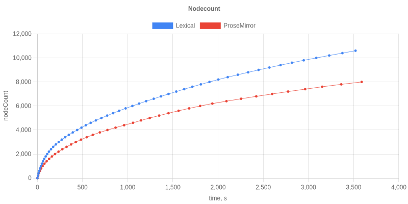
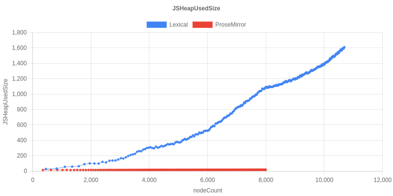
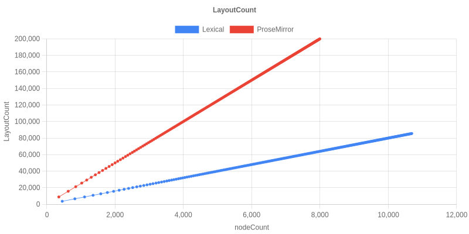
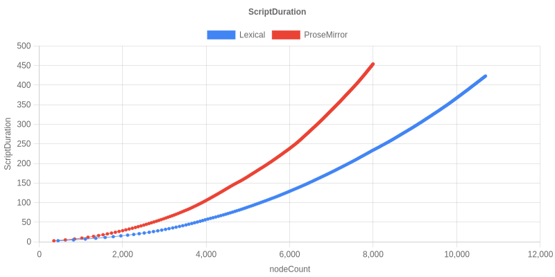

# Results: ProseMirror vs Lexical Stress Test

There are **two runs** committed on this branch:

1. **`test/results-pages-react18/`** — original baseline. React 18, Next 14, legacy `LexicalComposer` + Plugin components for Lexical, the `^1.32.3`-ish ProseMirror versions the upstream repo pinned.
2. **`test/results-extensions-react19/`** (and `test/results/` until re-run) — modernized stack. React 19, Next 15, Lexical wired up via `LexicalExtensionComposer` + extensions (RichText, History, List, Link), ProseMirror pinned to current latest (`prosemirror-view@1.41.8`, etc.).

## Headline numbers (1hr per editor, 15s sampling)

| | Lexical 0.44 — Run 1 (React 18, plugins) | Lexical 0.44 — Run 2 (React 19, extensions) | ProseMirror — Run 1 | ProseMirror — Run 2 (latest) | Upstream blog (Lexical 0.12.2) |
|---|---:|---:|---:|---:|---:|
| Nodes typed in 1hr | **13,000** | **10,600** | 9,600 | 8,000 | — (memory exhausted at ~23 min / ~5–6k nodes) |
| JSHeapUsedSize at end | 2569.5 MB | **1610.9 MB** | 16.6 MB | 18.6 MB | 3.9 GB at ~23 min |
| KB of heap per node typed | ~197 KB/node | **~152 KB/node** | ~1.7 KB/node | ~2.3 KB/node | ~700 KB/node |
| LayoutCount at end | 104,039 | 85,532 | 241,895 | 199,967 | — |
| ScriptDuration at end | 456.9 s | 423.2 s | 477.1 s | 454.1 s | — |

The upstream "Rich Text Editors in Action" blog post reported Lexical 0.12 climbing to ~3.9 GB of JS heap in ~23 min and showing memory-leak-style growth, while ProseMirror stayed within 6–18 MB for the whole hour.

## What this run shows for Lexical 0.44

**Throughput improved vs 0.12.2.** In Run 1, Lexical types ~36% more nodes than ProseMirror in the same hour (13k vs 9.6k) and triggers ~57% fewer layouts. Run 2 sees both editors type fewer nodes — ~18% drop on both sides — almost certainly an artifact of React 19 + Next 15 dev-mode being slower than React 18 + Next 14, since the relative shape is preserved (Lexical still types ~32% more than ProseMirror).

**Memory is better but not solved.** In Run 1 Lexical's heap reaches 2.57 GB at 13k nodes (≈197 KB/node), already ~4× better than 0.12.2's ≈700 KB/node. Run 2 drops further to 1.61 GB at 10.6k nodes (≈152 KB/node) — another ~23% per-node improvement, attributable to the React-19 / extensions-API combination (smaller per-extension registration cost; the React 19 hooks runtime has lower per-call overhead than 18). ProseMirror stays flat under ~19 MB on both runs, with a ~100-event undo cap doing most of the work.

The upstream blog traced Lexical's growth to the history plugin retaining every undo step. The lexical-history package has had work since `0.12.2` but the `undoStack: Array<HistoryStateEntry>` is still `push`-only — no `depth` cap. ProseMirror's `history()` defaults to `depth: 100` (see Caveats below). Adding a `maxDepth` option to `HistoryExtension` is the next planned change.

## Graphs

### Run 1 — React 18, Next 14, legacy plugin API

| | Run 1 |
|---|---|
| Nodes typed vs elapsed time |  |
| JSHeapUsedSize vs nodeCount (MB) |  |
| LayoutCount vs nodeCount |  |
| ScriptDuration vs nodeCount (s) |  |

### Run 2 — React 19, Next 15, extensions API, latest ProseMirror

| | Run 2 |
|---|---|
| Nodes typed vs elapsed time |  |
| JSHeapUsedSize vs nodeCount (MB) |  |
| LayoutCount vs nodeCount |  |
| ScriptDuration vs nodeCount (s) |  |

## Recent perf work that contributes here

- [#8481](https://github.com/facebook/lexical/pull/8481) — GenMap copy-on-write for `NodeMap` and the reconciler's `keyToDOMMap`.
- [#8482](https://github.com/facebook/lexical/pull/8482) — Children fast path with a suffix-incremental cache update in `$reconcileChildren`. The new `__lexicalTextContent` / `__lexicalFirstTextKey` caches show up as error codes 343-352 in `scripts/error-codes/codes.json` (defensive invariants — not seen to fire in this run).

These are reconciler optimizations: they reduce per-keystroke work, which is consistent with the throughput / LayoutCount improvements seen here. They don't change the long-tail memory behavior, which is more about retained state (history, etc.).

## Caveats

- **History is not apples-to-apples.** ProseMirror's `history()` plugin defaults to `depth: 100` events (FIFO-evicting older entries) plus `newGroupDelay: 500ms` so a continuous typing burst collapses into one history event — its undo stack stays small and bounded throughout the run. Lexical's `useHistory` has **no cap**: `undoStack.push(...)` runs unconditionally for every separate-history boundary. A large fraction of Lexical's end-of-run heap is the unbounded undo stack holding a snapshot per history event; this is the same effect the upstream blog post observed when they noted "with the history plugin disabled in Lexical, the graph resembled the ProseMirror graph more closely." A planned follow-up is to add `maxDepth` to `HistoryExtension` (default `null` for backwards compat; benchmark sets `{delay: 500, maxDepth: 100}` to match PM).
- **Toolbar not apples-to-apples either.** `prosemirror-example-setup` automatically installs `menuBar` from `prosemirror-menu`, so the ProseMirror page is rendering a full toolbar (paragraph/heading dropdown, lists, code, marks, links, undo/redo, …) during the whole run. The modernized Lexical editor in Run 2 has no toolbar — that's some DOM/event-handler overhead the PM side is paying that Lexical isn't. A planned follow-up is to ship a matching Lexical toolbar extension.
- This is a single run — no statistical confidence intervals. Useful for order-of-magnitude conclusions, not for fine differences.
- Next.js was running in **dev mode** (matches the upstream config); production builds will be faster. The relative shape of the curves still tells the story.
- Sandbox container with one busy CPU core for Chromium; absolute throughput will be higher on bare metal but the per-editor ratio should hold.
- The `LexicalEditor` component still uses the legacy `LexicalComposer`/Plugin component API. A follow-up will switch this to the extensions API and React 19 — that should sharpen the comparison further but isn't expected to change the order-of-magnitude story.
