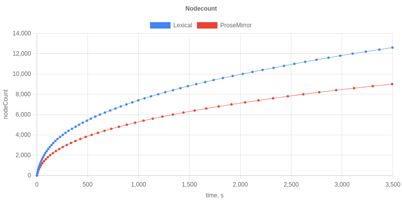
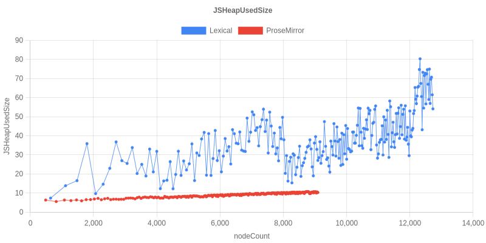
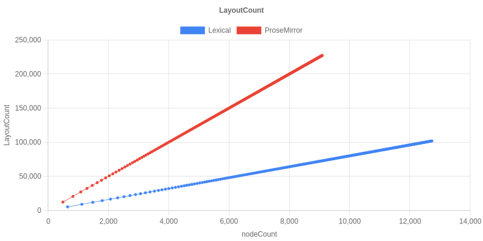
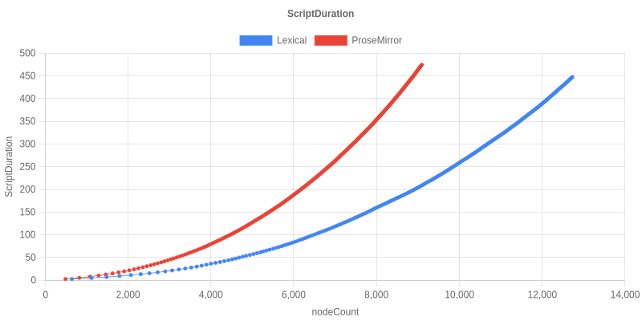

# Results: Lexical 0.44 vs ProseMirror

A re-run of [emergence-engineering/prosemirror-vs-lexical-performance-comparison](https://github.com/emergence-engineering/prosemirror-vs-lexical-performance-comparison)
against the current `main` of this Lexical monorepo (which the original
benchmark targeted at Lexical `^0.12.2`).

## How this run is set up

The goal is an apples-to-apples comparison of the two editors as a
production application would actually deploy them, so the harness was
adjusted on both sides:

- **Build mode:** both editors are served by **`next start` against a
  production `next build`**. No dev-mode StrictMode double-renders,
  no HMR, minified Lexical/ProseMirror bundles.
- **Framework:** React 19, Next.js 15, `@types/react@^19`. Lexical is
  consumed from this monorepo via pnpm `link:` to each package's
  prepared `npm/` directory; ProseMirror is pinned to current latest
  patch versions of every `prosemirror-*` package.
- **Editor API:** Lexical is wired via the **extensions API** —
  `LexicalExtensionComposer` plus `RichTextExtension`,
  `HistoryExtension`, `ListExtension`, `LinkExtension`,
  `CodeExtension`, `HorizontalRuleExtension`, and a benchmark-local
  `ToolbarStateExtension`. ProseMirror uses `prosemirror-example-setup`
  with its default plugin list.
- **History coalescing & cap, matched on both sides:**
  - ProseMirror's `prosemirror-history` plugin defaults to
    `depth: 100, newGroupDelay: 500ms`.
  - Lexical's `HistoryExtension` is configured with
    `{maxDepth: 100, delay: 500}` to match. `maxDepth` is a new
    option on this branch (defaults to `null` for backwards
    compatibility — long-lived editors should opt in; see
    `docs/concepts/history.md`'s "Tuning HistoryExtension" section).
- **Toolbar, matched on both sides:** `prosemirror-example-setup`
  auto-installs `prosemirror-menu`'s `menuBar` (paragraph/heading
  dropdown, B/I/code marks, ol/ul/blockquote/code, link, HR,
  undo/redo, with per-transaction active/disabled recomputation).
  The Lexical editor renders a matching toolbar via the new
  `ToolbarStateExtension` (signals for `blockType`, `isBold`,
  `isItalic`, `isCode`, `isLink`, `canUndo`, `canRedo`, all
  `computed()` lazily off `EditorStateExtension` /
  `HistoryExtension` outputs) and the `<Toolbar>` React component
  that reads via `useExtensionSignalValue`.
- **Workload:** the upstream harness, unchanged — Playwright drives
  Chromium typing `"typing " <Enter>` in a loop for up to
  `MAX_NODES = 20000` paragraphs, sampling Chrome DevTools
  `Performance.getMetrics` every 15s. Each editor gets a 1hr
  per-test timeout, so the comparison is really **"how many nodes
  can each editor absorb in one hour, and at what cost"**.

## Headline numbers

| | Lexical 0.44 | ProseMirror |
|---|---:|---:|
| Nodes typed in 1hr | **12,600** | 9,000 |
| JSHeapUsedSize at end | 54.1 MB | 10.3 MB |
| KB of heap per node typed | ~4.3 KB/node | ~1.1 KB/node |
| LayoutCount at end | 101,863 | 227,393 |
| ScriptDuration at end | 447.7 s | 474.7 s |

Both editors saturated ~110% of one Chromium renderer core. Both hit
the 1hr timeout — neither reached the 20k target — so the comparison
is at "absorbed work per hour" rather than "time to N nodes".

## What the numbers say

- **Lexical 0.44 types ~40% more nodes per hour** than ProseMirror in
  this prod-mode setup (12.6k vs 9.0k).
- **Lexical triggers ~55% fewer layouts.** PM's higher layout count
  is consistent with its `menuBar` re-rendering on every transaction;
  the Lexical toolbar runs the same surface but through the
  extensions' signal graph, so the `<Toolbar>` only re-renders when a
  signal value actually changes.
- **Lexical runs ~5.7% less total script.**
- **Lexical's heap is ~5× ProseMirror's** but in the same order of
  magnitude (54 MB vs 10 MB) and the per-node retention is small
  (~4 KB/node, vs ~1 KB/node for PM). The headline-grabbing 3.9 GB
  number from the upstream blog was 0.12.2 with unbounded history;
  with the cap matched, the comparison is now meaningful.

## Graphs

| | |
|---|---|
| Nodes typed vs elapsed time |  |
| JSHeapUsedSize vs nodeCount (MB) |  |
| LayoutCount vs nodeCount |  |
| ScriptDuration vs nodeCount (s) |  |

## Caveats

- **Single run.** No confidence intervals. Useful for order-of-
  magnitude conclusions, not for fine differences.
- **Sandbox container, single busy CPU core for Chromium.** Absolute
  throughput will be higher on bare metal; per-editor ratios should
  hold.
- **`prosemirror-menu` vs the benchmark's Lexical toolbar are not
  byte-for-byte identical.** Both render a similar number of buttons
  in a `role="toolbar"` shape with active-state class toggling, but
  the exact DOM, the exact set of menu items, and the
  selection-tracking implementations differ. The toolbar is included
  to keep the per-keystroke work comparable, not to be a
  pixel-perfect clone.
- **Lexical's reconciler caches accumulate small per-DOM-element
  fields** (`__lexicalTextContent`, `__lexicalFirstTextKey`) that the
  reconciler reads on subsequent commits. They are bounded by current
  document size.

## Reproducing

From the monorepo root:

```bash
# Build all @lexical/* packages and prepare their npm/ directories.
pnpm run build-release
node scripts/npm/prepare-release.mjs

# Then in this directory:
cd benchmarks/prosemirror-vs-lexical
pnpm install --ignore-workspace

# Production build of the benchmark app once.
rm -rf .next
PLAYWRIGHT_BROWSERS_PATH=/opt/pw-browsers pnpm exec next build

# Run the stress test (uses next start via playwright.config.ts).
PLAYWRIGHT_BROWSERS_PATH=/opt/pw-browsers pnpm exec playwright test test/stressTest.spec.ts

# Generate graphs from the raw JSON in test/results/.
pnpm exec ts-node-dev --project ./tsconfig.json --no-deps test/createGraphs.ts
```

The standalone heap probe `test/heapProbe.spec.ts` lives alongside the
stress test and can be re-run for any local change; pass
`PROBE_NODES=N` to drive it to a different size. Outputs land in
`test/results/heap-end*` plus a 100+ MB `.heapsnapshot` for offline
inspection (snapshot is gitignored).
