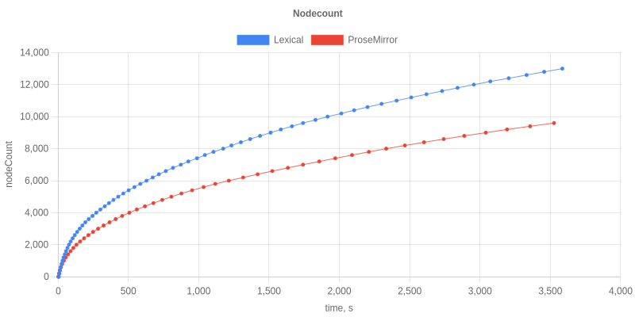
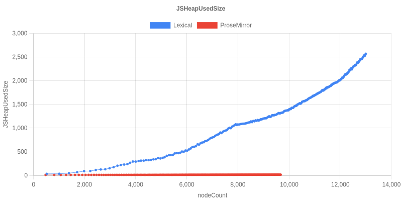
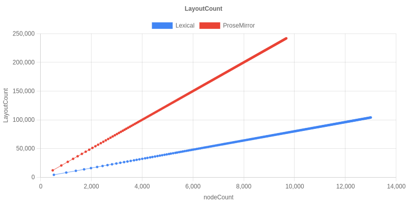
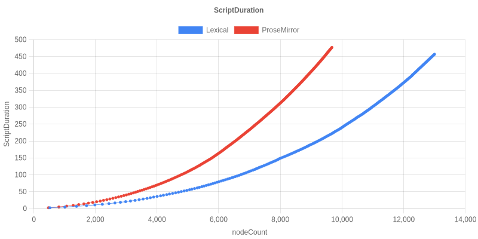

# Results: ProseMirror vs Lexical Stress Test

## Run details

- **Date:** 2026-05-21
- **Lexical:** built locally from `claude/update-lexical-benchmarks-EGeXV` (= `main` + this branch's harness wiring, at monorepo version `0.44.0`). All `@lexical/*` packages consumed from `packages/<pkg>/npm` via pnpm `link:` (see [README.md](./README.md)).
- **ProseMirror:** versions from upstream `package.json` (essentially same as the original benchmark — `prosemirror-view` `^1.32.3`, etc., resolved to latest patch).
- **Harness:** the upstream Playwright test from [emergence-engineering/prosemirror-vs-lexical-performance-comparison](https://github.com/emergence-engineering/prosemirror-vs-lexical-performance-comparison) (typing `"typing " <Enter>` in a loop, sampling Chrome DevTools `Performance.getMetrics` every 15s). Defaults: `MAX_NODES=20000`, `TIMEOUT=3600000ms` per editor (the test exits when the per-test 1hr timeout hits, whichever comes first).
- **Browser:** Chromium `141.0.7390.37` (Playwright `1.56.1`, headless shell), Node `22.22.2`.
- **Host:** Linux sandbox container, single chromium renderer pinned at ~100-120% CPU during typing.

Both tests hit the 1hr timeout — neither reached 20k — so the comparison is **"how many nodes can each editor absorb in one hour, and at what cost"**.

## Headline numbers

| | Lexical 0.44 | ProseMirror | Upstream blog (Lexical 0.12) |
|---|---:|---:|---:|
| Nodes typed in 1hr | **13,000** | 9,600 | — (memory exhausted at ~23 min / ~5-6k nodes) |
| JSHeapUsedSize at end | **2569.5 MB** | 16.6 MB | 3.9 GB at ~23 min |
| LayoutCount at end | 104,039 | 241,895 | — |
| ScriptDuration at end | 456.9 s | 477.1 s | — |

The upstream "Rich Text Editors in Action" blog post reported Lexical 0.12 climbing to ~3.9 GB of JS heap in ~23 min and showing memory-leak-style growth, while ProseMirror stayed within 6–18 MB for the whole hour.

## What this run shows for Lexical 0.44

**Throughput improved.** Lexical now types `~36%` more nodes than ProseMirror in the same hour (13k vs 9.6k) and triggers `~57%` fewer layouts.

**Memory is better but not solved.** Lexical's heap still climbs roughly linearly with content (2.5 GB at 13k nodes here, vs 3.9 GB at ~5–6k nodes for `0.12.2`) — so the **growth rate per node is roughly 4× smaller** than the original numbers (≈197 KB/node now vs ≈700 KB/node before), but the curve is still a slope, not a plateau. ProseMirror stays flat under 17 MB.

The upstream post traced the growth to the history plugin keeping every undo step in memory; the lexical-history package has had work since `0.12.2` but the undo stack is still proportional to edit count.

## Graphs

### Nodes typed vs elapsed time

### JSHeapUsedSize vs nodeCount (MB)

### LayoutCount vs nodeCount

### ScriptDuration vs nodeCount (seconds)

## Recent perf work that contributes here

- [#8481](https://github.com/facebook/lexical/pull/8481) — GenMap copy-on-write for `NodeMap` and the reconciler's `keyToDOMMap`.
- [#8482](https://github.com/facebook/lexical/pull/8482) — Children fast path with a suffix-incremental cache update in `$reconcileChildren`. The new `__lexicalTextContent` / `__lexicalFirstTextKey` caches show up as error codes 343-352 in `scripts/error-codes/codes.json` (defensive invariants — not seen to fire in this run).

These are reconciler optimizations: they reduce per-keystroke work, which is consistent with the throughput / LayoutCount improvements seen here. They don't change the long-tail memory behavior, which is more about retained state (history, etc.).

## Caveats

- **History is not apples-to-apples.** ProseMirror's `history()` plugin defaults to `depth: 100` events (FIFO-evicting older entries) plus `newGroupDelay: 500ms` so a continuous typing burst collapses into one history event — its undo stack stays small and bounded throughout the run. Lexical's `useHistory` has **no cap**: `undoStack.push(...)` runs unconditionally for every separate-history boundary. A large fraction of Lexical's 2.5 GB end-of-run heap is the unbounded undo stack holding a snapshot per history event; this is the same effect the upstream blog post observed when they noted "with the history plugin disabled in Lexical, the graph resembled the ProseMirror graph more closely." A fair next run should either match the cap (`depth: 100` in PM ↔ a future bounded undo stack in Lexical) or disable history on both.
- This is a single run — no statistical confidence intervals. Useful for order-of-magnitude conclusions, not for fine differences.
- Next.js was running in **dev mode** (matches the upstream config); production builds will be faster. The relative shape of the curves still tells the story.
- Sandbox container with one busy CPU core for Chromium; absolute throughput will be higher on bare metal but the per-editor ratio should hold.
- The `LexicalEditor` component still uses the legacy `LexicalComposer`/Plugin component API. A follow-up will switch this to the extensions API and React 19 — that should sharpen the comparison further but isn't expected to change the order-of-magnitude story.
