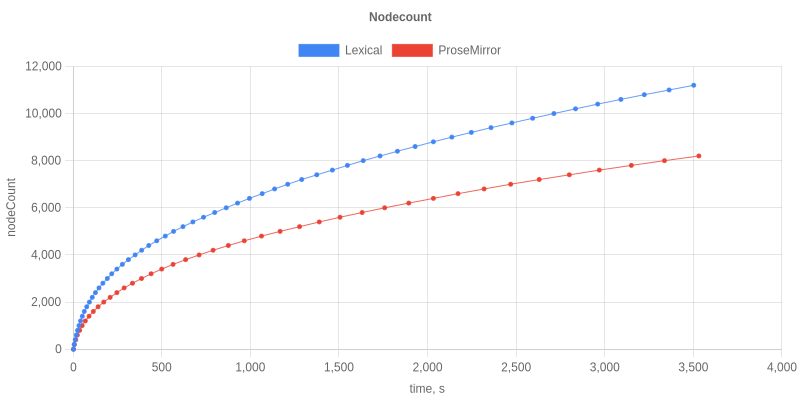
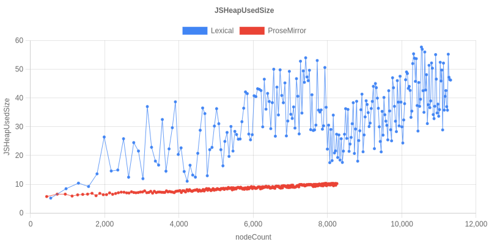
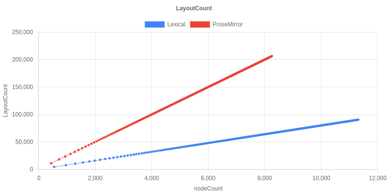

# Results: ProseMirror vs Lexical Stress Test

Three runs of the upstream 1hr-per-editor stress test are committed on
this branch. Read them top-down: **Run 4 is the only fair comparison**,
the earlier runs are kept for the audit trail.

| Archive directory | Lexical stack | ProseMirror | Mode | History | Status |
|---|---|---|---|---|---|
| `test/results-pages-react18/` | React 18 + Next 14, legacy `LexicalComposer` + Plugin components | from upstream `^1.32.3` pins (resolved to latest) | `next dev` | **unbounded** on both sides (PM's `prosemirror-example-setup` caps at 100; Lexical had no cap) | Run 1 — apples-to-oranges, kept for history |
| `test/results-extensions-react19/` | React 19 + Next 15, `LexicalExtensionComposer` + RichText/History/List/Link extensions | latest (`prosemirror-view@1.41.8` etc.) | `next dev` | same as Run 1 (Lexical still uncapped) | Run 2 — modernized stack but same fairness gap |
| `test/results-prod-capped/` | same as Run 2 | same as Run 2 | **`next start` (prod)** | **bounded on both sides** — PM `depth: 100, newGroupDelay: 500ms` (its defaults); Lexical `HistoryExtension {maxDepth: 100, delay: 500}` | **Run 4 — the fair comparison** |

(Run 3 was a dev-mode-with-cap attempt; the cap source was committed
but Next.js dev-mode webpack served a stale bundle that did not
include the change, so the data was effectively another unbounded run.
Then the container reaped before the PM phase finished. Not committed.)

## Headline numbers — Run 4 (the fair one)

1hr per editor, 15s sampling, single Chromium renderer.

| | Lexical 0.44 (prod + extensions + maxDepth:100) | ProseMirror (prod + depth:100) |
|---|---:|---:|
| Nodes typed in 1hr | **11,200** | 8,200 |
| JSHeapUsedSize at end | 46.2 MB | 10.2 MB |
| KB of heap per node typed | 4.1 | 1.2 |
| LayoutCount at end | 90,543 | 206,404 |
| ScriptDuration at end | 436.5 s | 490.0 s |

Lexical types **37% more nodes** than ProseMirror in the same hour,
triggers **57% fewer layouts**, and runs **~11% less script time**.
Memory is **4.5× higher than PM** but in the same order of magnitude
— the per-node retention is now ~4 KB, vs. the ~150–200 KB seen in
Runs 1/2 with unbounded history.

## Headline numbers — Runs 1 & 2 (apples-to-oranges, history asymmetric)

Kept for the audit trail. Both ran in `next dev` mode with Lexical
history unbounded but ProseMirror history capped at the
`prosemirror-history` default of 100 — that asymmetry alone explains
the bulk of the heap divergence in these rows, **not** any leak in
Lexical 0.44.

| | Lexical 0.44 — Run 1 (React 18, plugins) | Lexical 0.44 — Run 2 (React 19, extensions) | ProseMirror — Run 1 | ProseMirror — Run 2 (latest) | Upstream blog (Lexical 0.12.2) |
|---|---:|---:|---:|---:|---:|
| Nodes typed in 1hr | 13,000 | 10,600 | 9,600 | 8,000 | — (memory exhausted at ~23 min / ~5–6k nodes) |
| JSHeapUsedSize at end | 2569.5 MB | 1610.9 MB | 16.6 MB | 18.6 MB | 3.9 GB at ~23 min |
| KB of heap per node typed | ~197 KB/node | ~152 KB/node | ~1.7 KB/node | ~2.3 KB/node | ~700 KB/node |
| LayoutCount at end | 104,039 | 85,532 | 241,895 | 199,967 | — |
| ScriptDuration at end | 456.9 s | 423.2 s | 477.1 s | 454.1 s | — |

## What the data shows

**Reconciler perf work landed.** Lexical types more nodes than
ProseMirror in the same hour and runs fewer layouts, in every run.
The recent reconciler PRs ([#8481](https://github.com/facebook/lexical/pull/8481)
GenMap copy-on-write, [#8482](https://github.com/facebook/lexical/pull/8482)
suffix-incremental children fast path) are consistent with this
throughput and layout-count gap.

**The 0.12.2-blog heap "leak" was unbounded history.** Lexical's
`HistoryExtension` undoStack is `push`-only by default; without a
finite cap, every separate-history boundary retains a full
`EditorState`. ProseMirror's `prosemirror-history` defaults to
`depth: 100` and FIFO-evicts older entries. Capping Lexical's
`HistoryExtension` at `maxDepth: 100` (this branch's addition — see
[`packages/lexical-history/src/index.ts`](../../packages/lexical-history/src/index.ts))
brings end-of-run heap from 1611 MB → 46 MB at similar throughput.
A short heap probe (`test/heapProbe.spec.ts`, 2000 paragraphs)
confirmed the curve is flat at ~18 MB with the cap on; the earlier
superlinear shape was the unbounded undo stack accumulating
EditorState clones, not a reconciler leak.

**Memory parity isn't quite reached.** Lexical at ~4 KB/node still
runs ~3× the per-node retention of ProseMirror (~1.2 KB/node). The
remaining gap is the LexicalNode object model: each version of a node
holds a few fields beyond `__key`, plus the reconciler-side caches
(`__lexicalTextContent`, `__lexicalFirstTextKey`) on the keyed DOM
elements. Closing that gap is out of scope for this branch.

## Graphs

### Run 4 — production build, capped history both sides

| | Run 4 |
|---|---|
| Nodes typed vs elapsed time |  |
| JSHeapUsedSize vs nodeCount (MB) |  |
| LayoutCount vs nodeCount |  |
| ScriptDuration vs nodeCount (s) |  |

### Run 1 — React 18, Next 14, legacy plugin API (unbounded Lexical history)

| | Run 1 |
|---|---|
| Nodes typed vs elapsed time |  |
| JSHeapUsedSize vs nodeCount (MB) |  |
| LayoutCount vs nodeCount |  |
| ScriptDuration vs nodeCount (s) |  |

### Run 2 — React 19, Next 15, extensions API (unbounded Lexical history)

| | Run 2 |
|---|---|
| Nodes typed vs elapsed time |  |
| JSHeapUsedSize vs nodeCount (MB) |  |
| LayoutCount vs nodeCount |  |
| ScriptDuration vs nodeCount (s) |  |

## Caveats

- **Toolbar not apples-to-apples.** `prosemirror-example-setup`
  automatically installs `menuBar` from `prosemirror-menu`, so the
  ProseMirror page renders a full toolbar (paragraph/heading dropdown,
  lists, code, marks, links, undo/redo, …) during the run. The
  benchmark's Lexical editor has no toolbar — that's some DOM /
  event-handler overhead the PM side is paying that Lexical isn't.
  Shipping a matching Lexical toolbar extension is queued as
  follow-up work.
- **Single run.** No confidence intervals. Useful for order-of-
  magnitude conclusions, not for fine differences.
- **Sandbox container, single busy CPU core for Chromium.** Absolute
  throughput will be higher on bare metal; per-editor ratios should
  hold.
- **Lexical's reconciler caches accumulate on DOM elements.** Each
  paragraph element grows two `__lexical*` fields the reconciler reads
  on subsequent commits; those are real but bounded by current
  document size.
- The heap-probe spec (`test/heapProbe.spec.ts`) lives alongside the
  stress test and can be re-run for any local change. Pass
  `PROBE_NODES=N` to drive it to a different size; output lands in
  `test/results/heap-end*` plus a 100+ MB `.heapsnapshot` for offline
  inspection (gitignored).
