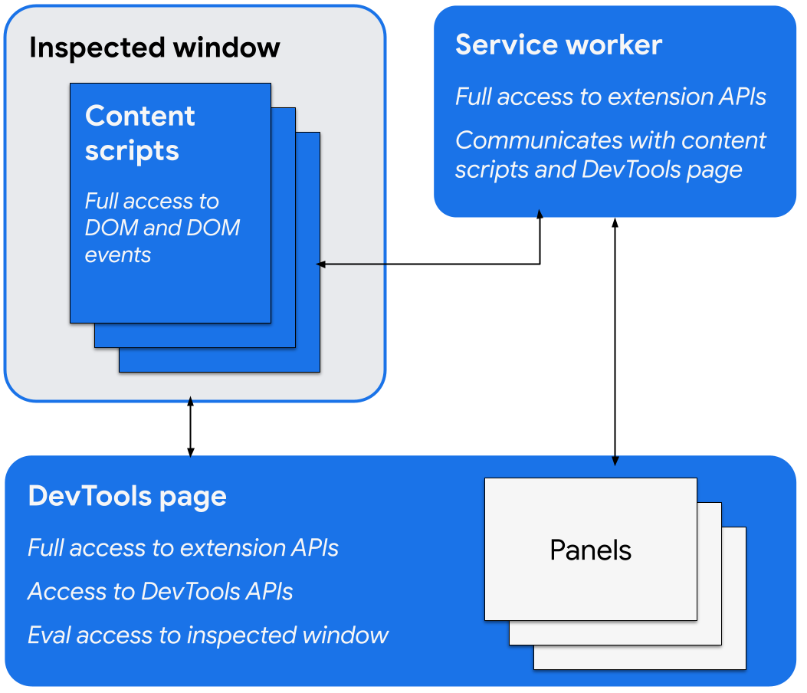

# Lexical DevTools browser extension

This is the source code for the Lexical DevTools browser extension.

[link-chrome]: https://chromewebstore.google.com/detail/lexical-developer-tools/kgljmdocanfjckcgfpcpdoklodllfdpc 'Version published on Chrome Web Store'
[link-edge]: https://microsoftedge.microsoft.com/addons/detail/lexical-developer-tools/pclbkaofdgafcfhlnimcdhhkkhcabpcb 'Version published on Edge Add-ons Store'
[link-firefox]: https://addons.mozilla.org/en-US/firefox/addon/lexical-developer-tools/ 'Version published on Mozilla Add-ons'
[link-safari]: https://apps.apple.com/us/app/lexical-developer-tools/id6502753400 'Version published on Mac App Store'

[][link-chrome] [][link-chrome]

[][link-edge] [][link-edge]

[][link-firefox] [][link-firefox]

[][link-safari] [][link-safari]

## Local development

Lexical DevTools extension uses [WXT](https://wxt.dev/) framework to simplify development. Please refer to [WXT Development Guide](https://wxt.dev/guide/development.html) for comprehensive documentation.

**TLDR:**
```bash
$ npm run dev
# In browser: Alt+R to force reload extension
```

**Useful Hints:**
- Extension activity log: [chrome://extensions/?activity=eddfjidloofnnmloonifcjkpmfmlblab](chrome://extensions/?activity=eddfjidloofnnmloonifcjkpmfmlblab)
- Status of ServiceWorkers: [chrome://serviceworker-internals/?devtools](chrome://serviceworker-internals/?devtools)
- WXT Framework debugging: `DEBUG_WXT=1 npm run dev`
- If you detach the Dev Tools in a separate window, and press `Cmd+Option+I` while Dev Tools window is focused, you will invoke the Dev Tools for the Dev Tools window.

**Safari:**

To develop and run Safari version of the extension you (obviously) need a Mac and Xcode installed. Safari on the contrary to other browsers doesn't accept web extensions as a zip archive but rather requires you to [wrap it in native code (Swift) wrapper](https://developer.apple.com/documentation/safariservices/safari_web_extensions/converting_a_web_extension_for_safari/). Fortunately this process is mostly automated here.

```bash
# Install Xcode

# Environment setup
sudo xcode-select -s /Applications/Xcode.app
xcodebuild --install
sudo xcodebuild -license
xcodebuild -runFirstLaunch

# Normal operation
npm run dev:safari

# Build & upload to Apple Connect
BUILD_VERSION=0 npm run safari:archive 
PASSWORD="XXX" npm run safari:upload
```

## Publishing flow

**Preconditions:**

If new version of the extension contains big changes to it's UI or functionality, before proceeding, go to the web UI of every marketplace and update screenshots and preview videos.

**Chrome, Firefox, Edge:**

Go to the ["Publish DevTools extension to stores" GitHub action](https://github.com/facebook/lexical/actions/workflows/devtools-extension-publish.yml) and start it manually. Increase "Build version" in case publish happens more than once within single Lexical monorepo version.

**Safari:**

Automation is pending, pls contact vladlen_fedosov@epam.com

## Requesting maintainer access to extension marketplaces

At this moment all marketplaces are governed by [EPAM Open Source Office](https://www.epam.com/open-source) (contact [Vladlen Fedosov](mailto:vladlen_fedosov@epam.com) or [Christopher Howard](mailto:christopher_howard@epam.com)) and the access request flow is the following:

**Firefox:**

1. Create Mozilla account: https://accounts.firefox.com/settings
2. Enable two factor authentication for this account.
3. Go to https://addons.mozilla.org/en-US/firefox/users/edit and set a "Display Name" for your account.
4. Email to [Vladlen Fedosov](mailto:vladlen_fedosov@epam.com) and [Christopher Howard](mailto:christopher_howard@epam.com) with the request to add you as a maintainer to Firefox Add-Ons for Lexical Developer Tools extension. Pls include: Firefox account email; reasoning description.
5. _[For Maintainer]_ Open [authors & license management page](https://addons.mozilla.org/en-US/developers/addon/lexical-developer-tools/ownership) and add new user email.

**Edge:**

1. Create Microsoft account: https://account.microsoft.com/account
2. Enable two factor authentication for this account.
3. Email to [Vladlen Fedosov](mailto:vladlen_fedosov@epam.com) and [Christopher Howard](mailto:christopher_howard@epam.com) with the request to add you as a maintainer to Microsoft Edge App-ons for Lexical Developer Tools extension. Pls include: Microsoft account email; reasoning description.
4. _[For Maintainer]_ Open [Account settings | User management](https://partner.microsoft.com/en-us/dashboard/account/v3/usermanagement#users) and add new user email as guest account.

**Chrome:**

Google limits [Extension Group Publisher](https://developer.chrome.com/docs/webstore/group-publishers/) member accounts to have the same domain names. So at this moment please reach out to [Vladlen Fedosov](mailto:vladlen_fedosov@epam.com) and [Christopher Howard](mailto:christopher_howard@epam.com) if you need to do any changes to the extension listing. Use publishing flow described above to release new versions.

We consider moving publisher to `@thelexical.onmicrosoft.com` or linking `lexical.dev` to `thelexical.onmicrosoft.com` AD.

**Safari:**

Apple limits App Store Connect member accounts to have the same domain names. So at this moment please reach out to [Vladlen Fedosov](mailto:vladlen_fedosov@epam.com) and [Christopher Howard](mailto:christopher_howard@epam.com) if you need to do any changes to the extension listing. New version publishing flow is automation is coming soon.

We consider creating new Apple Store Connect for `thelexical.onmicrosoft.com` AD, but it requires DUNS registered organization.

## Design

This extension follows typical [Browser DevTools architecture](https://developer.chrome.com/docs/extensions/how-to/devtools/extend-devtools) that includes sereral independent contexts that communicate via events or extension APIs.

<figure align="center">
  
  <figcaption>DevTools extension architecture.</figcaption>
</figure>
