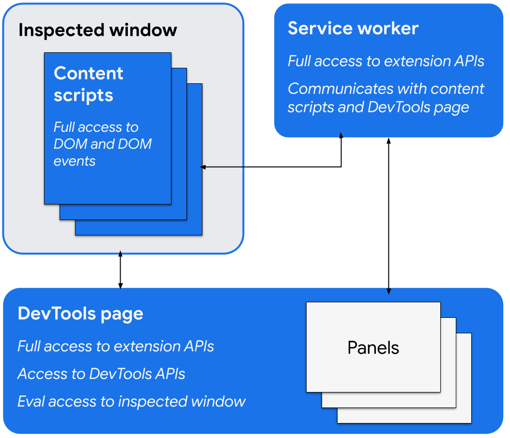

# Lexical DevTools browser extension

This is the source code for the Lexical DevTools browser extension.

[link-chrome]: https://chromewebstore.google.com/detail/lexical-developer-tools/kgljmdocanfjckcgfpcpdoklodllfdpc 'Version published on Chrome Web Store'
[link-firefox]: https://addons.mozilla.org/en-US/firefox/addon/lexical-developer-tools/ 'Version published on Mozilla Add-ons'
[link-safari]: https://apps.apple.com/us/app/lexical-developer-tools/id6502753400 'Version published on Mac App Store'

[][link-chrome] [][link-chrome]

[][link-firefox] [][link-firefox]

[][link-safari] [][link-safari]

## Local development

Lexical DevTools extension uses [WXT](https://wxt.dev/) framework to simplify development. Please refer to [WXT Development Guide](https://wxt.dev/guide/introduction.html) for comprehensive documentation.

**TLDR:**
```bash
$ pnpm run dev
# In browser: Alt+R to force reload extension
```

**Useful Hints:**
- Extension activity log: [chrome://extensions/?activity=eddfjidloofnnmloonifcjkpmfmlblab](chrome://extensions/?activity=eddfjidloofnnmloonifcjkpmfmlblab)
- Status of ServiceWorkers: [chrome://serviceworker-internals/?devtools](chrome://serviceworker-internals/?devtools)
- WXT Framework debugging: `DEBUG_WXT=1 pnpm run dev`
- If you detach the Dev Tools in a separate window, and press `Cmd+Option+I` while Dev Tools window is focused, you will invoke the Dev Tools for the Dev Tools window.

**Safari:**

To develop and run Safari version of the extension you (obviously) need a Mac and Xcode installed. Safari on the contrary to other browsers doesn't accept web extensions as a zip archive but rather requires you to [wrap it in native code (Swift) wrapper](https://developer.apple.com/documentation/safariservices/safari_web_extensions/converting_a_web_extension_for_safari/). Fortunately this process is mostly automated here.

```bash
# Install Xcode

# Environment setup
sudo xcode-select -s /Applications/Xcode.app
xcodebuild --install
sudo xcodebuild -license
xcodebuild -runFirstLaunch

# Normal operation
pnpm run dev:safari

# Build & upload to Apple Connect
BUILD_VERSION=0 pnpm run safari:archive 
PASSWORD="XXX" pnpm run safari:upload
```

## Publishing flow

**Preconditions:**

If new version of the extension contains big changes to it's UI or functionality, before proceeding, go to the web UI of every marketplace and update screenshots and preview videos.

**Chrome, Firefox:**

Go to the ["Publish DevTools extension to stores" GitHub action](https://github.com/facebook/lexical/actions/workflows/devtools-extension-publish.yml) and start it manually. Increase "Build version" in case publish happens more than once within single Lexical monorepo version.

The published version is `<package.json version>.<build version>`, e.g. `0.52.0.1`. A few things to know before re-running the workflow:

- "Build version" must be a plain integer (`0`, `1`, `2`, …). It is parsed with `parseInt`, so a value like `0.52.1` silently becomes `0` and you end up re-publishing the same version.
- Both stores reject a version they already have. Firefox fails with `409 Conflict: Version X already exists.`, Chrome with `CWS item upload state is FAILURE`. Bump "Build version" rather than retrying the same one.
- Chrome also rejects an upload while a previous submission is still in review. Either wait for the review to finish, or cancel the pending submission in the Developer Dashboard first.
- The two stores are submitted independently, so a run can succeed for one and fail for the other. Check which line is `✓` in the log before assuming nothing shipped — a re-run with a bumped build version will then push the two stores out of sync by one build number, which is harmless.

**Safari:**

Automation is pending, pls contact vladlen_fedosov@epam.com

## Requesting maintainer access to extension marketplaces

At this moment all marketplaces are governed by [EPAM Open Source Office](https://www.epam.com/open-source) (contact [Vladlen Fedosov](mailto:vladlen_fedosov@epam.com) or [Christopher Howard](mailto:christopher_howard@epam.com)) and the access request flow is the following:

**Firefox:**

1. Create Mozilla account: https://accounts.firefox.com/settings
2. Enable two factor authentication for this account.
3. Go to https://addons.mozilla.org/en-US/firefox/users/edit and set a "Display Name" for your account.
4. Email to [Vladlen Fedosov](mailto:vladlen_fedosov@epam.com) and [Christopher Howard](mailto:christopher_howard@epam.com) with the request to add you as a maintainer to Firefox Add-Ons for Lexical Developer Tools extension. Pls include: Mozilla account email; reasoning description.
5. _[For Maintainer]_ Open [authors & license management page](https://addons.mozilla.org/en-US/developers/addon/lexical-developer-tools/ownership) and add new user email.

**Chrome:**

Chrome no longer requires publisher members to share a domain name — the Chrome Web Store [dropped the distinction between individual and group publishers](https://developer.chrome.com/docs/webstore/share-ownership), and an admin can now invite any Google account to a publisher. So the request flow is:

1. Make sure you have a Google account with [2-Step Verification](https://support.google.com/accounts/answer/185839) enabled — the Chrome Web Store requires it to publish or update an item.
2. Email [Vladlen Fedosov](mailto:vladlen_fedosov@epam.com) and [Christopher Howard](mailto:christopher_howard@epam.com) with the request to add you as a member of the publisher that owns Lexical Developer Tools. Pls include: Google account email; the role you need; reasoning description.
3. _[For Maintainer]_ Open the publisher's **Settings → Members** page in the [Developer Dashboard](https://chrome.google.com/webstore/devconsole), choose "Invite member" and pick a role:
   - **Item Manager** — update metadata and upload new packages. Enough for day-to-day releases.
   - **Editor** — the above, plus publisher settings and trusted testers.
   - **Admin** — the above, plus managing members and roles.
4. Accept the invitation from the email Google sends.

Use the publishing flow described above to release new versions; you only need dashboard access for listing changes such as screenshots, description and preview videos.

**Safari:**

Apple limits App Store Connect member accounts to have the same domain names. So at this moment please reach out to [Vladlen Fedosov](mailto:vladlen_fedosov@epam.com) and [Christopher Howard](mailto:christopher_howard@epam.com) if you need to do any changes to the extension listing. New version publishing flow is automation is coming soon.

We consider creating new Apple Store Connect for `thelexical.onmicrosoft.com` AD, but it requires DUNS registered organization.

## Refreshing the publishing credentials

The ["Publish DevTools extension to stores"](https://github.com/facebook/lexical/actions/workflows/devtools-extension-publish.yml) workflow authenticates with repository secrets, all prefixed `EXTENSION_`. `pnpm run publish-extension` runs `wxt submit`, which is an alias for [`publish-browser-extension`](https://github.com/aklinker1/publish-browser-extension), so every secret below maps onto one of that tool's environment variables. Rotating any of them needs admin access to the `facebook/lexical` repository settings.

| Secret | `publish-browser-extension` env var | Where it comes from | Expires? |
| --- | --- | --- | --- |
| `EXTENSION_CHROME_EXTENSION_ID` | `CHROME_EXTENSION_ID` | The item ID in the [listing URL](https://chromewebstore.google.com/detail/lexical-developer-tools/kgljmdocanfjckcgfpcpdoklodllfdpc), and under the extension name in the Developer Dashboard | No — it is a public identifier, fixed for the lifetime of the item |
| `EXTENSION_CHROME_CLIENT_ID`, `EXTENSION_CHROME_CLIENT_SECRET` | `CHROME_CLIENT_ID`, `CHROME_CLIENT_SECRET` | OAuth 2.0 client in the Google Cloud project with the Chrome Web Store API enabled | No, but see the API v2 note below |
| `EXTENSION_CHROME_REFRESH_TOKEN` | `CHROME_REFRESH_TOKEN` | The [OAuth Playground](https://developers.google.com/oauthplayground), authorized as a Google account with access to the publisher — see below | Yes — revoked if the OAuth consent screen stays in "Testing", if unused for six months, or if the granting Google account loses access |
| `EXTENSION_CHROME_PUBLISH_TARGET` | `CHROME_PUBLISH_TARGET` | `default` for the public channel, `trustedTesters` for the internal one | No |
| `EXTENSION_FIREFOX_EXTENSION_ID` | `FIREFOX_EXTENSION_ID` | The add-on slug or GUID on [AMO](https://addons.mozilla.org/en-US/firefox/addon/lexical-developer-tools/) | No |
| `EXTENSION_FIREFOX_JWT_ISSUER`, `EXTENSION_FIREFOX_JWT_SECRET` | `FIREFOX_JWT_ISSUER`, `FIREFOX_JWT_SECRET` | [AMO API credentials](https://addons.mozilla.org/en-US/developers/addon/api/key/) of an account that is an author of the add-on | The secret is shown once at creation and is tied to that account — regenerate it if the account loses authorship |

Note that the Chrome extension ID is not a credential: if a Chrome publish fails, the cause is one of the OAuth secrets, a version collision, or a submission already in review — not a stale extension ID.

Any of these is re-set with the GitHub CLI, which prompts for the value rather than taking it on the command line, so it stays out of your shell history:

```bash
gh secret set EXTENSION_CHROME_REFRESH_TOKEN --repo facebook/lexical
# or, for a multi-line value such as a service account private key:
gh secret set EXTENSION_CHROME_SERVICE_ACCOUNT_PRIVATE_KEY --repo facebook/lexical < key.pem
```

### Regenerating the Chrome refresh token (API v1.1)

`CHROME_REFRESH_TOKEN` is the only Chrome credential that expires. To mint a new one:

1. In the [Google Cloud console](https://console.cloud.google.com/apis/credentials), open the OAuth 2.0 client that `CHROME_CLIENT_ID` belongs to and make sure `https://developers.google.com/oauthplayground` is listed under **Authorized redirect URIs**.
2. Open the [OAuth Playground](https://developers.google.com/oauthplayground), click the settings icon, tick **Use your own OAuth credentials**, and enter the client ID and secret.
3. Put `https://www.googleapis.com/auth/chromewebstore` in the "Input your own scopes" field and click **Authorize APIs**. Sign in as a Google account that is a member of the publisher that owns the extension — this does not have to be the account that owns the Cloud project.
4. Click **Exchange authorization code for tokens** and copy the refresh token.
5. `gh secret set EXTENSION_CHROME_REFRESH_TOKEN --repo facebook/lexical`.

Note that `wxt submit init` cannot do this for you: it still requests the authorization code through Google's out-of-band flow (`urn:ietf:wg:oauth:2.0:oob`), which [Google blocked for all OAuth clients on 31 January 2023](https://developers.google.com/identity/protocols/oauth2/resources/oob-migration). The Playground is the supported route, and the migration to API v2 below removes the refresh token altogether.

### Chrome Web Store API v2 migration

The credentials above use [Chrome Web Store API v1.1, which Google will stop serving on 15 October 2026](https://developer.chrome.com/blog/cws-api-v2). `publish-browser-extension` already warns about this on every run. The v2 API authenticates with a [Google Cloud service account](https://developer.chrome.com/docs/webstore/service-accounts) instead of a user refresh token, which means CI auth no longer expires and is no longer bound to one person's Google account.

To migrate:

1. In the Google Cloud project that has the Chrome Web Store API enabled, create a service account and a JSON key for it.
2. In the Developer Dashboard, add the service account email under the publisher's **Account** section. Only one service account can be linked per publisher.
3. Add the new repository secrets and update the workflow's `env:` block:

   | New secret | Env var | Value |
   | --- | --- | --- |
   | — | `CHROME_API_VERSION` | `v2` (can be hardcoded in the workflow) |
   | `EXTENSION_CHROME_PUBLISHER_ID` | `CHROME_PUBLISHER_ID` | From the Developer Dashboard URL, `https://chrome.google.com/webstore/devconsole/<publisher-id>` |
   | `EXTENSION_CHROME_SERVICE_ACCOUNT_CLIENT_EMAIL` | `CHROME_SERVICE_ACCOUNT_CLIENT_EMAIL` | `client_email` from the service account JSON key |
   | `EXTENSION_CHROME_SERVICE_ACCOUNT_PRIVATE_KEY` | `CHROME_SERVICE_ACCOUNT_PRIVATE_KEY` | `private_key` from the same file |

4. `CHROME_EXTENSION_ID` is unchanged. `CHROME_CLIENT_ID`, `CHROME_CLIENT_SECRET`, `CHROME_REFRESH_TOKEN` and `CHROME_PUBLISH_TARGET` are v1.1-only and can be deleted once v2 works.
5. Optionally set `CHROME_CANCEL_PENDING=true`, which v2 adds: it cancels an in-review submission instead of failing the run.

Running `pnpm --filter @lexical/devtools exec wxt submit init` walks through the v2 prompts interactively and writes the values to a local `.env.submit` file, which is a convenient way to generate them before copying them into repository secrets. Do not commit that file.

## Design

This extension follows typical [Browser DevTools architecture](https://developer.chrome.com/docs/extensions/how-to/devtools/extend-devtools) that includes sereral independent contexts that communicate via events or extension APIs.

<figure align="center">
  
  <figcaption>DevTools extension architecture.</figcaption>
</figure>
