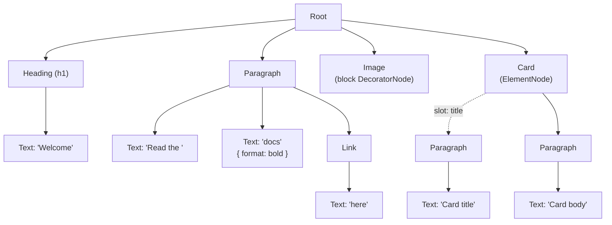

# Document Model

An [editor state](./editor-state.md) holds a tree of nodes. This page explains
how that tree is shaped.

## A DOM-like tree

Lexical's node tree is shaped like the HTML it renders. A paragraph is an
`ElementNode` whose children are the nodes inside it, and inline structure
nests the same way: a link is a `LinkNode` element that contains the text
nodes it wraps, just as an `<a>` contains its text. Each node type decides how
it renders with `createDOM()` and `updateDOM()`, so the model maps closely to
the DOM, and a position in the document is a node plus an offset within it.

Here is a small document with a heading, a paragraph containing bold text and
a link, a block image, and a card that has a named `title` slot as well as
ordinary body children:

Solid arrows are ordinary children, which form an ordered list under their
parent and are read with `getChildren()`. The dashed arrow is a
[named slot](./named-slots.md): a separate channel on the host, keyed by name
instead of position and read with `$getSlot(card, 'title')`. A slot's value
is the root of its own isolated region, so its `getParent()` is `null` and
`$getSlotHost()` leads back to the card. Any `ElementNode` or `DecoratorNode`
can host slots, so a decorator such as the image could also expose an
editable caption this way.

## Working with the tree

Lexical code navigates the document the way DOM code does, with methods like
`getParent()`, `getChildren()`, and `getNextSibling()`, and each node owns the
DOM it renders. The resemblance is structural, not one
node per HTML element: bold or italic text, for example, is a format on a
`TextNode`, not a separate `<strong>` or `<em>` node. See
[Nodes](./nodes.mdx) for the built-in node types.

## Customizing rendering

You can also change how nodes render without subclassing them.
[`DOMRenderExtension`](../serialization/dom-render.md) from `@lexical/html`
takes overrides for `createDOM`, `updateDOM`, and `exportDOM`, for one node
class or for every node, such as adding a `data-` attribute or wrapping a
node's children in another element. Each override calls `$next()` to get the
default result and adjusts it, so overrides from several extensions compose.
Export overrides only affect HTML export, and `createDOM` overrides also carry
through to export for nodes that use the default `exportDOM`. Changes made
while updating the editor's DOM don't; see
[Lexical -> HTML](../serialization/serialization.md#lexical---html) for which
hooks reach export.

For how the tree is converted to and from JSON, HTML, and Markdown, see
[Serialization](../serialization/serialization.md#formats-at-a-glance). For
how this model differs from a mark-based editor, see
[Compared with ProseMirror](./compared-with-prosemirror.md).
