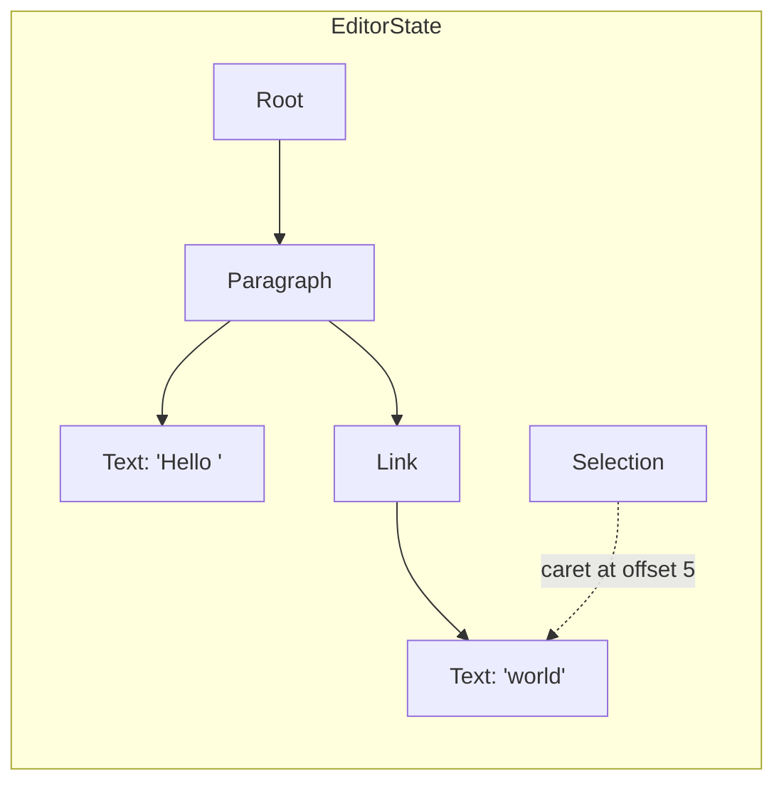

# Editor State

## Why is it necessary?

With Lexical, the source of truth is not the DOM, but rather an underlying state model
that Lexical maintains and associates with an editor instance.

While HTML is great for storing rich text content it's often "way too flexible" when it comes to text editing.
For example the following lines of content will produce equal outcome:

```html
<i><b>Lexical</b></i>
<i><b>Lex<b><b>ical</b></i>
<b><i>Lexical</i></b>
```

<details>
  <summary>See rendered version!</summary>
  <div>
    <i><b>Lexical</b></i>
    <i><b>Lex</b><b>ical</b></i>
    <b><i>Lexical</i></b>
  </div>
</details>

Of course, there are ways to normalize all these variants to a single canonical form, however this would require DOM manipulation and so re-rendering of the content. And to overcome this we can use Virtual DOM, or State.

On top of that it allows to decouple content structure from content formatting. Let's look at this example stored in HTML:

```html
<p>Why did the JavaScript developer go to the bar? <b>Because he couldn't handle his <i>Promise</i>s</b></p>
```

<figure class="text--center">
  
  <figcaption>Nested structure of the HTML state because of the formatting</figcaption>
</figure>

In contrast, Lexical decouples structure from formatting by offsetting this information to attributes. This allows us to have canonical document structure regardless of the order in which different styles were applied.

Here is the same content as a Lexical node tree, printed the way the
[tree view](/docs/getting-started/devtools) shows it (the numbers are node keys):

```text
root
  └ (2) paragraph
    ├ (3) text "Why did the JavaScript developer go to the bar? "
    ├ (4) text "Because he couldn't handle his " { format: bold }
    ├ (5) text "Promise" { format: bold, italic }
    └ (6) text "s" { format: bold }
```

The paragraph's children are a flat list of text nodes, and the formatting is a
property of each one, so there is only one way to represent this content.

## Understanding the Editor State

You can get the latest editor state from an editor by calling `editor.getEditorState()`.

Editor states have two phases:

- During an update they can be thought of as "mutable". See "Updating state" below to
  mutate an editor state.
- After an update, the editor state is then locked and deemed immutable from there on. This
  editor state can therefore be thought of as a "snapshot".

Editor states contain two core things:

- The editor node tree (starting from the root node). See
  [Document Model](./document-model.md) for how the tree is shaped.
- The editor [selection](./selection.md) (which can be null).

For example, "Hello world" with a link around "world" and the caret at the
end looks like this:



`editor.getEditorState()` returns the latest committed state. Its `toJSON()`
method serializes the document tree only; the selection and the runtime node
keys are not included. To restore saved content, pass the JSON to
`editor.parseEditorState()` and the result to `editor.setEditorState()`. The
editor must have the same node types registered. See
[Serialization](../serialization/serialization.md) for JSON, HTML, and
Markdown.

Here's an example of how you can initialize an editor with saved content and
then persist it. The saved JSON is passed as the editor's `$initialEditorState`:

```js
import {buildEditorFromExtensions} from '@lexical/extension';
import {RichTextExtension} from '@lexical/rich-text';
import {defineExtension} from 'lexical';

// Get the saved content (e.g. loaded from a backend)
const initialEditorState = await loadContent();

const editor = buildEditorFromExtensions(
  defineExtension({
    $initialEditorState: initialEditorState,
    dependencies: [RichTextExtension],
    name: '@my-app/editor',
  }),
);
editor.setRootElement(document.getElementById('editor'));

// Store the content (e.g. when the user submits a form)
async function onSubmit() {
  await saveContent(JSON.stringify(editor.getEditorState()));
}
```

With React, pass the extension to `LexicalExtensionComposer`. A component
rendered inside it can reach the editor with `useLexicalComposerContext()`:

```jsx
import {LexicalExtensionComposer} from '@lexical/react/LexicalExtensionComposer';
import {useLexicalComposerContext} from '@lexical/react/LexicalComposerContext';
import {RichTextExtension} from '@lexical/rich-text';
import {defineExtension} from 'lexical';
import {useMemo} from 'react';

function SaveButton() {
  const [editor] = useLexicalComposerContext();
  return (
    <button
      onClick={() => saveContent(JSON.stringify(editor.getEditorState()))}>
      Save
    </button>
  );
}

function Editor({initialEditorState}) {
  // The editor is recreated whenever this extension changes,
  // so keep it stable for the life of the editor.
  const extension = useMemo(
    () =>
      defineExtension({
        $initialEditorState: initialEditorState,
        dependencies: [RichTextExtension],
        name: '@my-app/editor',
      }),
    [initialEditorState],
  );
  return (
    <LexicalExtensionComposer extension={extension}>
      <SaveButton />
    </LexicalExtensionComposer>
  );
}
```

`$initialEditorState` is applied once, when the editor is built; changing it
later has no effect on that editor. See "Updating state" below for the proper
way to change editor state after initialization.

`$initialEditorState` accepts:

- a JSON string or a parsed `SerializedEditorState` object, passed to
  `editor.parseEditorState()` (as in the example above);
- an `EditorState` instance, applied directly with `editor.setEditorState()`;
- a function `(editor) => void`, run inside `editor.update(...)`;
- `null`, which skips default initialization entirely. Use this with
  [collaboration](/docs/collaboration/react) so that the Yjs document, not
  Lexical, owns the initial state.

Omitting the field (or passing `undefined`) seeds the root with a default empty
`ParagraphNode`. The two are not interchangeable: `null` leaves the root with no children,
while `undefined` produces a single empty line. If your `loadContent` may yield `null` or
`undefined` for new documents, coalesce to `undefined` (e.g. `(await loadContent()) ?? undefined`)
so the editor still gets the default paragraph rather than the collab-style uninitialized
state.

The legacy `LexicalComposer` takes the same values as `initialConfig.editorState`,
except that a function there only runs if the root is still empty.

## Updating state

All reads and writes of the document happen inside a synchronous callback:

```js
import {$createParagraphNode, $createTextNode, $getRoot} from 'lexical';

editor.update(() => {
  const paragraph = $createParagraphNode();
  paragraph.append($createTextNode('Hello world'));
  $getRoot().append(paragraph);
});

const text = editor.read('force-commit', () => $getRoot().getTextContent());
```

### The `$` function convention {#dollar-functions}

Functions whose names start with `$`, such as `$getRoot()` and
`$getSelection()`, only work inside one of these callbacks, because they act
on the active editor state. Calling them anywhere else throws an error. The
convention is similar to React Hooks:

| | React Hooks | Lexical `$` functions |
| -- | -- | -- |
| Naming | `useFunction` | `$function` |
| Can only be called | while rendering a component | inside an update or read |
| Can call others of the same kind | ✅ | ✅ |
| Must be synchronous | ✅ | ✅ |
| Must be called unconditionally, in the same order | ✅ | ❌ No such rule |

Command handlers and node transforms already run inside an update, so they
can call `$` functions directly.

This works because, while a callback runs, Lexical keeps the active editor and
the active editor state in module-level variables, and `$` functions read
them: `$getRoot()` returns the root of the active state, and `$getEditor()`
returns the active editor. Because the callback is synchronous, nothing else
can run in between and change them. The same mechanism enforces the
difference between reads and updates. Inside a read, a method that would
change a node throws `Cannot use method in read-only mode.`

Give your own functions a `$` prefix when they call `$` functions, so it is
clear where they can be used. The
[`@lexical/rules-of-lexical`](/docs/packages/lexical-eslint-plugin) ESLint rule
checks this convention.

The same rule applies to node objects. Call node methods only inside a read or
update. Every node has a key that identifies it across versions of the editor
state, and node methods use that key to find the latest version of the node.
This is why a node reference taken earlier in an update stays usable after the
node changes. Keys exist only at runtime: they are not serialized, and you
should treat them as opaque.

Because the callbacks are synchronous, do any asynchronous work (fetching
data, awaiting a promise) first, and then enter an update with the result.

Avoid nesting one `editor.update()` inside another: the inner update does not
run immediately but is queued to run after the outer one. Never start an
update inside a read.

Each update works on a pending copy of the editor state, and updates made in
the same tick are committed and reconciled to the DOM together. See
[Updates](./updates.mdx#update-lifecycle) for the full lifecycle.

### Replacing the state

Another way to set state is `setEditorState` method, which replaces current state with the one passed as an argument.

Here's an example of how you can set editor state from a stringified JSON:

```js
const editorState = editor.parseEditorState(editorStateJSONString);
editor.setEditorState(editorState);
```

:::warning

`setEditorState` rejects an `EditorState` that satisfies `editorState.isEmpty()` — i.e.
the root is the only node and there is no selection. In a development build it throws
`"setEditorState: the editor state is empty. Ensure the editor state's root node never
becomes empty."`; in production it warns with the same message and recovers by appending
an empty `ParagraphNode`, so the editor stays usable. The `EditorState` produced by
initializing with `editorState: null` and never appending content (typical for a
collaboration document before peers connect) has exactly this shape, so persisting and
reloading such a state hits this path. Note that `parseEditorState` itself succeeds — the
check lands on the apply step. To avoid relying on the recovery, guard with
`editorState.isEmpty()` before calling `setEditorState`, or seed the document with a
`ParagraphNode` before serializing.

:::

## Reading state

Which state you see depends on how you read it:

- Inside `editor.update()` you see the **pending** state, where your changes
  are visible but transforms and reconciliation may not have run yet.
  `editor.read('pending', fn)` gives you the same view without allowing
  changes.
- `editor.read('force-commit', fn)` first commits any pending updates, so it
  always sees a consistent, reconciled state. Do not call it inside an update.
  `editor.read(fn)` with no mode does the same thing, and is kept for
  convenience and backwards compatibility. Inside a mutation or update
  listener it does not commit an update that another listener started (that
  update commits after the listeners have run, so they observe commits in
  order); use `editor.read('latest', fn)` there.
- `editor.read('latest', fn)` reads the most recently reconciled state without
  committing anything, so pending changes are not visible.
- `editorState.read(fn, {editor})` reads one particular snapshot, such as the
  `editorState` an update listener receives. Passing the `editor` keeps
  `$getEditor()` and extension lookups working inside the callback.

## State update listener

If you want to know when the editor updates so you can react to the changes, you can add an update
listener to the editor, as shown below:

```js
editor.registerUpdateListener(({editorState}) => {
  // The latest EditorState can be found as `editorState`.
  // To read the contents of the EditorState, use the following API:

  editorState.read(
    () => {
      // Just like editor.update(), .read() expects a closure where you can use
      // the $ prefixed helper functions.
    },
    // Passing the editor keeps $getEditor() and extension lookups working.
    {editor},
  );
});
```

## When are Listeners, Transforms, and Commands called?

There are several types of callbacks that can be registered with the editor that are related to
updates of the Editor State.

| Callback Type | When It's Called |
| -- | -- |
| Update Listener | After reconciliation |
| Mutation Listener | After reconciliation |
| Node Transform | During `editor.update()`, after the callback finishes, if any instances of the node type they are registered for were updated |
| Command | As soon as the command is dispatched to the editor (called from an implicit `editor.update()`) |

## Synchronous reconciliation with discrete updates

While commit scheduling and batching are normally what we want, they can sometimes get in the way.

Consider this example: you're trying to manipulate an editor state in a server context and then persist it in a database.

```js
editor.update(() => {
  // manipulate the state...
});

saveToDatabase(editor.getEditorState().toJSON());
```

This code will not work as expected, because the `saveToDatabase` call will happen before the state has been committed.
The state that will be saved will be the same one that existed before the update.

Fortunately, the `discrete` option for `LexicalEditor.update` forces an update to be immediately committed.

```js
editor.update(() => {
  // manipulate the state...
}, {discrete: true});

saveToDatabase(editor.getEditorState().toJSON());
```

### Cloning state

Lexical state can be cloned, optionally with custom selection. One of the scenarios where you'd want to do it
is setting editor's state but not forcing any selection:

```js
// Passing `null` as a selection value to prevent focusing the editor
editor.setEditorState(editorState.clone(null));
```
