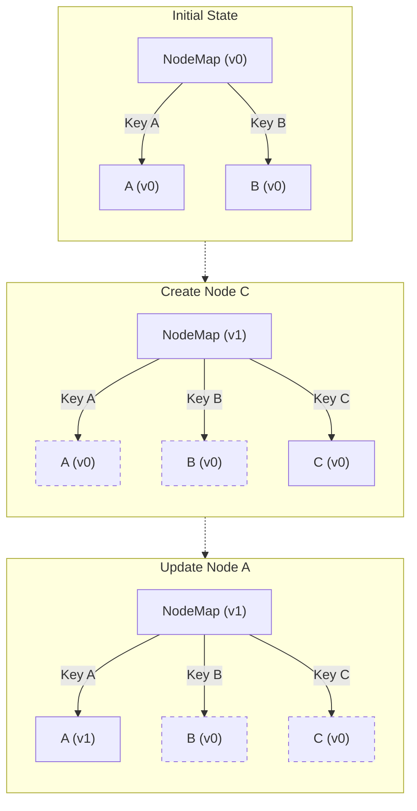

# Key Management

Keys are a fundamental concept in Lexical that enable efficient state management and node tracking. Understanding how keys work is crucial for building reliable editor implementations.

## What are Keys?

The `__key` property is a unique identifier assigned to each node in the Lexical editor. These keys are:
- Automatically generated by Lexical
- Used to track nodes in the editor state
- Essential for state management and updates
- Immutable during a node's lifecycle

## When to Use `__key`?

### ✅ Correct Usage

Keys should ONLY be used in two specific situations:

1. **In Node Constructors**
```typescript
class MyCustomNode extends ElementNode {
  constructor(someData: string, key?: NodeKey) {
    super(key); // Correctly passing key to parent constructor
    this.__someData = someData;
  }
}
```

2. **In Static Clone Methods**
```typescript
class MyCustomNode extends ElementNode {
  static clone(node: MyCustomNode): MyCustomNode {
    return new MyCustomNode(node.__someData, node.__key);
  }
}
```

### ❌ Incorrect Usage

Never use keys in these situations:

```typescript
// ❌ Don't pass keys between different nodes
const newNode = new MyCustomNode(existingNode.__key);

// ❌ Don't manipulate keys directly
node.__key = 'custom-key';
```

## How Lexical Uses Keys

### Diagram

The dotted outlines show nodes that are re-used in a zero-copy fashion from one EditorState to the next



### Node Map Structure

The EditorState maintains a `Map<NodeKey, LexicalNode>` that tracks all nodes. Nodes refer to each other using keys in their internal pointers:

```typescript
// Internal node structure (not for direct usage)
{
  __prev: null | NodeKey,
  __next: null | NodeKey,
  __parent: null | NodeKey,
  // __first, __last and __size are only for ElementNode to track its children
  __first: null | NodeKey,
  __last: null | NodeKey,
  __size: number
}
```

These internal pointers maintain the tree structure and should never be manipulated directly.

### Key-Related APIs

1. **Editor Methods**
   ```typescript
   // Get node by key
   const node = editor.getElementByKey(key);
   const node = $getNodeByKey(key);

   // Get latest version of a node
   const latest = node.getLatest();
   
   // Get mutable version for updates
   const mutable = node.getWritable();
   ```

### Key Lifecycle

NodeKeys are ephemeral and have several important characteristics:

1. **Serialization**
   - Keys are never serialized
   - New keys are generated when deserializing (from JSON/HTML)
   - Keys are only meaningful within their EditorState instance

2. **Uniqueness**
   - Keys are unique within an EditorState
   - Current implementation uses serial numbers for debugging
   - Should be treated as random and opaque values
   - Never logically reused

Keys are used internally by Lexical to:
1. Track nodes in the editor state
2. Manage node updates and versions
3. Maintain referential integrity
4. Enable efficient state updates

## Common Pitfalls

1. **Key Reuse**
   ```typescript
   // ❌ Never do this
   function duplicateNode(node: LexicalNode) {
     return new SameNodeType(data, node.__key);
   }
   ```

2. **Manual Key Assignment**
   ```typescript
   // ❌ Never do this
   node.__key = generateCustomKey();
   ```

3. **Incorrect Constructor/Clone Implementation**
   ```typescript
   // ❌ Never do this - missing key in constructor
   class MyCustomNode extends ElementNode {
     constructor(someData: string) {
       super(); // Missing key parameter
       this.__someData = someData;
     }
   }

   // ✅ Correct implementation
   class MyCustomNode extends ElementNode {
     __someData: string;

     constructor(someData: string, key?: NodeKey) {
       super(key);
       this.__someData = someData;
     }
     
     static clone(node: MyCustomNode): MyCustomNode {
       return new MyCustomNode(node.__someData, node.__key);
     }

     afterCloneFrom(prevNode: this): void {
       super.afterCloneFrom(prevNode);
       this.__someData = prevNode.__someData;
     }
   }
   ```

4. **Node Replacement**
   ```typescript
   // ❌ Never re-use the key when changing the node class
   const editorConfig = {
     nodes: [
       CustomNodeType,
       {
         replace: OriginalNodeType,
         with: (node: OriginalNodeType) => new CustomNodeType(node.__key),
         withKlass: CustomNodeType
       }
     ]
   };

   // ✅ Correct: Use node replacement configuration
   const editorConfig = {
     nodes: [
       CustomNodeType,
       {
         replace: OriginalNodeType,
         with: (node: OriginalNodeType) => new CustomNodeType(),
         withKlass: CustomNodeType
       }
     ]
   };
   ```

   For proper node replacement, see the [Node Replacement guide](node-replacement.md).

## Best Practices

1. **Let Lexical Handle Keys**
   ```typescript
   import {$applyNodeReplacement} from 'lexical';

   // Create node helper function
   export function $createMyCustomNode(data: string): MyCustomNode {
     return $applyNodeReplacement(new MyCustomNode(data));
   }
   ```

## Testing Considerations

When writing tests involving node keys:

```typescript
test('node creation', async () => {
  await editor.update(() => {
    // ✅ Correct: Create nodes normally
    const node = new MyCustomNode("test");
    
    // ✅ Correct: Keys are automatically handled
    expect(node.__key).toBeDefined();
    expect(node.__key).not.toBe('');
  });
});
```

## Performance Impact

Understanding key management is crucial for performance:

1. Keys enable efficient node lookup (O(1))
2. Proper key usage prevents unnecessary re-renders
3. Lexical's key system optimizes state updates
4. Improper key manipulation can cause performance issues

## Common Questions

**Q: How do I reference a node later?**
A: Store a reference to the node. Conventionally, all node methods will use `getLatest()` or `getWritable()` which will look up the latest version of that node before reading or writing its properties, which is equivalent to using the key but is type-safe (but may cause errors if you try to use a reference to a node that no longer exists). In some situations it may be preferable to use the key directly, which is also fine.

**Q: How do I ensure unique nodes?**
A: Let Lexical handle key generation and management. Focus on node content and structure. 