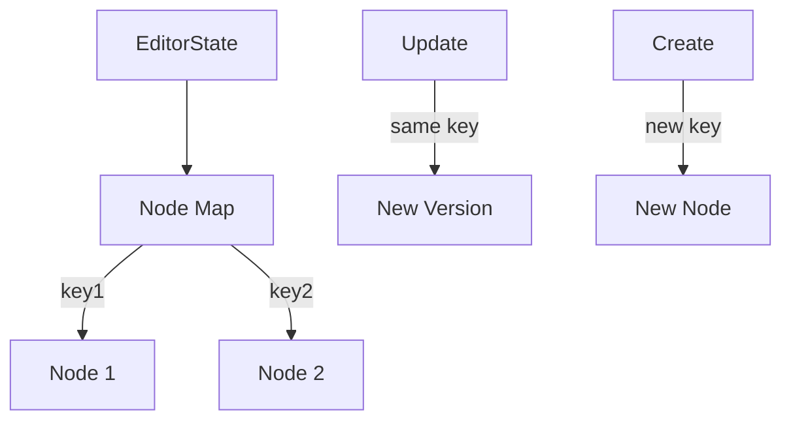

# Key Management

Keys are a fundamental concept in Lexical that enable efficient state management and node tracking. Understanding how keys work is crucial for building reliable editor implementations.

## What are Keys?

The `__key` property is a unique identifier assigned to each node in the Lexical editor. These keys are:
- Automatically generated by Lexical
- Used to track nodes in the editor state
- Essential for state management and updates
- Immutable during a node's lifecycle

## When to Use `__key`?

### ✅ Correct Usage

Keys should ONLY be used in two specific situations:

1. **In Node Constructors**
```typescript
class MyCustomNode extends ElementNode {
  constructor(someData: string, key?: NodeKey) {
    super(key); // Correctly passing key to parent constructor
    this.__someData = someData;
  }
}
```

2. **In Static Clone Methods**
```typescript
class MyCustomNode extends ElementNode {
  static clone(node: MyCustomNode): MyCustomNode {
    return new MyCustomNode(node.__someData, node.__key);
  }
}
```

### ❌ Incorrect Usage

Never use keys in these situations:

```typescript
// ❌ Don't pass keys between different nodes
const newNode = new MyCustomNode(existingNode.__key);

// ❌ Don't manipulate keys directly
node.__key = 'custom-key';
```

## How Lexical Uses Keys



Keys are used internally by Lexical to:
1. Track nodes in the editor state
2. Manage node updates and versions
3. Maintain referential integrity
4. Enable efficient state updates

## Common Pitfalls

1. **Key Reuse**
   ```typescript
   // ❌ Never do this
   function duplicateNode(node: LexicalNode) {
     return new SameNodeType(data, node.__key);
   }
   ```

2. **Manual Key Assignment**
   ```typescript
   // ❌ Never do this
   node.__key = generateCustomKey();
   ```

## Best Practices

1. **Let Lexical Handle Keys**
   ```typescript
   // ✅ Correct: Let Lexical create new nodes
   const newNode = new MyCustomNode("data");
   ```

2. **Use Node References Properly**
   ```typescript
   // ✅ Correct: Use node keys only in constructors
   constructor(data: string, key?: NodeKey) {
     super(key);
     this.__data = data;
   }
   ```

3. **Store Node References**
   ```typescript
   // ✅ Correct: Store node identifiers, not keys
   const nodeIdentifier = {
     type: node.getType(),
     data: node.getData()
   };
   ```

## Testing Considerations

When writing tests involving node keys:

```typescript
test('node creation', async () => {
  await editor.update(() => {
    // ✅ Correct: Create nodes normally
    const node = new MyCustomNode("test");
    
    // ✅ Correct: Keys are automatically handled
    expect(node.__key).toBeDefined();
    expect(node.__key).not.toBe('');
  });
});
```

## Performance Impact

Understanding key management is crucial for performance:

1. Keys enable efficient node lookup (O(1))
2. Proper key usage prevents unnecessary re-renders
3. Lexical's key system optimizes state updates
4. Improper key manipulation can cause performance issues

## Common Questions

**Q: How do I reference a node later?**
A: Store node identifiers (like type and data) instead of keys. Use Lexical's APIs to find nodes when needed.

**Q: What if I need to track specific nodes?**
A: Use Lexical's node selection and traversal APIs instead of storing keys.

**Q: How do I ensure unique nodes?**
A: Let Lexical handle key generation and management. Focus on node content and structure. 