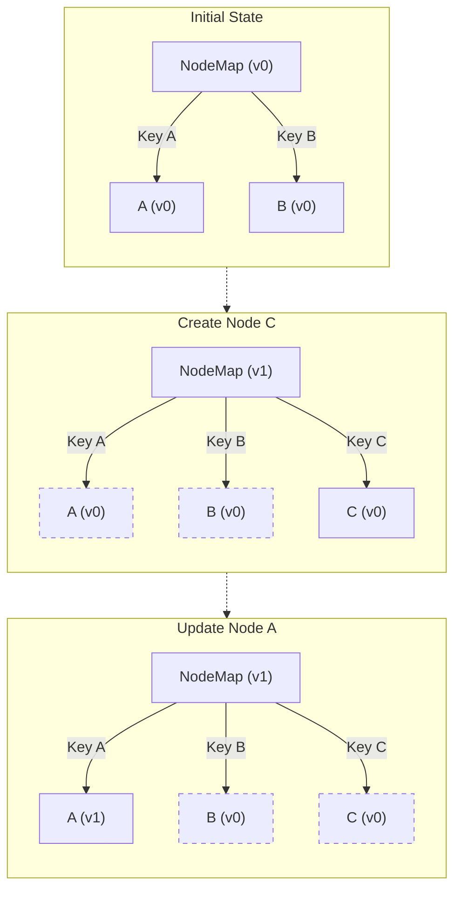

# Key Management

Keys are a fundamental concept in Lexical that enable efficient state management and node tracking. Understanding how keys work is crucial for building reliable editor implementations.

## What are Keys?

The `__key` property is a unique identifier assigned to each node in the Lexical editor. These keys are:
- Automatically generated by Lexical
- Used to track nodes in the editor state
- Essential for state management and updates
- Immutable during a node's lifecycle

## When to Use `__key`?

### ✅ Correct Usage

Pass `__key` through constructors and clone methods in these two situations.
To reference a node from application code, use `node.getKey()` and the
[key-related APIs](#key-related-apis) instead of accessing `__key` directly.

1. **In Node Constructors**
```typescript
class MyCustomNode extends ElementNode {
  constructor(someData: string, key?: NodeKey) {
    super(key); // Correctly passing key to parent constructor
    this.__someData = someData;
  }
}
```

2. **In Static Clone Methods**
```typescript
class MyCustomNode extends ElementNode {
  static clone(node: MyCustomNode): MyCustomNode {
    return new MyCustomNode(node.__someData, node.__key);
  }
}
```

### ❌ Incorrect Usage

Never use keys in these situations:

```typescript
// ❌ Don't pass keys between different nodes
const newNode = new MyCustomNode(existingNode.__key);

// ❌ Don't manipulate keys directly
node.__key = 'custom-key';
```

## How Lexical Uses Keys

### Diagram

The dotted outlines show nodes that are re-used in a zero-copy fashion from one EditorState to the next


```mermaid
graph TB
  subgraph s0["Initial State"]
    direction TB
    m0["NodeMap (v0)"]
    m0 -->|Key A| n0a["A (v0)"]
    m0 -->|Key B| n0b["B (v0)"]
  end
  subgraph s1["Create Node C"]
    direction TB
    style n1a stroke-dasharray: 5 5
    style n1b stroke-dasharray: 5 5
    m1["NodeMap (v1)"]
    m1 -->|Key A| n1a["A (v0)"]
    m1 -->|Key B| n1b["B (v0)"]
    m1 -->|Key C| n1c["C (v0)"]
  end
  subgraph s2["Update Node A"]
    direction TB
    style n2a stroke-dasharray: 5 0
    style n2b stroke-dasharray: 5 5
    style n2c stroke-dasharray: 5 5
    m2["NodeMap (v1)"]
    m2 -->|Key A| n2a["A (v1)"]
    m2 -->|Key B| n2b["B (v0)"]
    m2 -->|Key C| n2c["C (v0)"]
  end
  s0 -.-> s1 -.-> s2
```

### Node Map Structure

The EditorState maintains a `Map<NodeKey, LexicalNode>` that tracks all nodes. Nodes refer to each other using keys in their internal pointers:

```typescript
// Internal node structure (not for direct usage)
{
  __prev: null | NodeKey,
  __next: null | NodeKey,
  __parent: null | NodeKey,
  // __first, __last and __size are only for ElementNode to track its children
  __first: null | NodeKey,
  __last: null | NodeKey,
  __size: number
}
```

These internal pointers maintain the tree structure and should never be manipulated directly.

### Key-Related APIs

1. **Editor Methods**
   ```typescript
   // Get node by key
   const node = $getNodeByKey(key);

   // Get the DOM element a node key is reconciled to
   const element = editor.getElementByKey(key);

   // Get latest version of a node
   const latest = node.getLatest();
   
   // Get mutable version for updates
   const mutable = node.getWritable();
   ```

### Referencing a node in a later callback

A callback (for example, a React event handler or a promise continuation) can
run after its target node has been removed. A non-null JavaScript reference
does not guarantee that the node still exists in the active editor state.
Methods that use `getLatest()` or `getWritable()` can then throw
`Lexical node does not exist in active editor state.`

You can store a node reference and use it in a later read or update. Node
methods resolve the latest version from the active editor state, so keeping a
reference preserves the node's type. For an action that targets a node in the
document, check `node.isAttached()` inside the same `editor.update()` callback
before using it:

```typescript
import type {LexicalEditor, LexicalNode} from 'lexical';

function createSelectNodeCallback(editor: LexicalEditor, node: LexicalNode) {
  return () => {
    editor.update(() => {
      if (node.isAttached()) {
        node.selectEnd();
      }
    });
  };
}
```

`isAttached()` checks whether the node is still connected to the root in the
active state. It returns `false` if the node is detached or is no longer in
that state's node map, so it is safe to call on a reference to a removed node
inside a read or update.

Alternatively, you can capture `node.getKey()` and resolve that key when the
callback runs. Keep the lookup, attachment check, and mutation inside the same
`editor.update()` callback:

```typescript
import type {LexicalEditor, NodeKey} from 'lexical';

import {$getNodeByKey} from 'lexical';

function createSelectNodeCallback(editor: LexicalEditor, nodeKey: NodeKey) {
  return () => {
    editor.update(() => {
      const node = $getNodeByKey(nodeKey);
      if (node !== null && node.isAttached()) {
        node.selectEnd();
      }
    });
  };
}
```

`$getNodeByKey()` returns `null` when the key is absent from the active state.
A node can also still be in that state's node map after being detached, before
garbage collection removes it. For an action that targets a node in the
document, check `isAttached()` as well.

Both `$getNodeByKey()` and `isAttached()` require an active read or update
context. Checking them before `editor.update()`, or keeping a check's result
across an `await`, does not validate the state in which the mutation runs.
For a read-only callback, perform the lookup, check, and read together inside
`editor.read()`. Use the editor that owns the node; keys are not persistent
identifiers for use across editors or serialization.

### Key Lifecycle

NodeKeys are ephemeral and have several important characteristics:

1. **Serialization**
   - Keys are never serialized
   - New keys are generated when deserializing (from JSON/HTML)
   - Keys are only meaningful within their EditorState instance

2. **Uniqueness**
   - Keys are unique within an EditorState
   - Current implementation uses serial numbers for debugging
   - Should be treated as random and opaque values
   - Never logically reused

Keys are used internally by Lexical to:
1. Track nodes in the editor state
2. Manage node updates and versions
3. Maintain referential integrity
4. Enable efficient state updates

## Common Pitfalls

1. **Key Reuse**
   ```typescript
   // ❌ Never do this
   function duplicateNode(node: LexicalNode) {
     return new SameNodeType(data, node.__key);
   }
   ```

2. **Manual Key Assignment**
   ```typescript
   // ❌ Never do this
   node.__key = generateCustomKey();
   ```

3. **Incorrect Constructor/Clone Implementation**
   ```typescript
   // ❌ Never do this - missing key in constructor
   class MyCustomNode extends ElementNode {
     constructor(someData: string) {
       super(); // Missing key parameter
       this.__someData = someData;
     }
   }

   // ✅ Correct implementation
   class MyCustomNode extends ElementNode {
     __someData: string;

     constructor(someData: string, key?: NodeKey) {
       super(key);
       this.__someData = someData;
     }
     
     static clone(node: MyCustomNode): MyCustomNode {
       return new MyCustomNode(node.__someData, node.__key);
     }

     afterCloneFrom(prevNode: this): void {
       super.afterCloneFrom(prevNode);
       this.__someData = prevNode.__someData;
     }
   }
   ```

4. **Node Replacement**
   ```typescript
   // ❌ Never re-use the key when changing the node class
   const editorConfig = {
     nodes: [
       CustomNodeType,
       {
         replace: OriginalNodeType,
         with: (node: OriginalNodeType) => new CustomNodeType(node.__key),
         withKlass: CustomNodeType
       }
     ]
   };

   // ✅ Correct: Use node replacement configuration
   const editorConfig = {
     nodes: [
       CustomNodeType,
       {
         replace: OriginalNodeType,
         with: (node: OriginalNodeType) => new CustomNodeType(),
         withKlass: CustomNodeType
       }
     ]
   };
   ```

   For proper node replacement, see the [Node Replacement guide](node-replacement.md).

## Best Practices

1. **Let Lexical Handle Keys**
   ```typescript
   import {$applyNodeReplacement} from 'lexical';

   // Create node helper function
   export function $createMyCustomNode(data: string): MyCustomNode {
     return $applyNodeReplacement(new MyCustomNode(data));
   }
   ```

## Testing Considerations

When writing tests involving node keys:

```typescript
test('node creation', async () => {
  await editor.update(() => {
    // ✅ Correct: Create nodes normally
    const node = new MyCustomNode("test");
    
    // ✅ Correct: Keys are automatically handled
    expect(node.__key).toBeDefined();
    expect(node.__key).not.toBe('');
  });
});
```

## Performance Impact

Understanding key management is crucial for performance:

1. Keys enable efficient node lookup (O(1))
2. Proper key usage prevents unnecessary re-renders
3. Lexical's key system optimizes state updates
4. Improper key manipulation can cause performance issues

## Common Questions

**Q: How do I reference a node later?**
A: Store a reference to the node. Its methods resolve the latest version inside a read or update, preserving the node's type. If the node may have been removed, check `node.isAttached()` in that same context before using it. Storing the key and resolving it with `$getNodeByKey()` is also supported. See [Referencing a node in a later callback](#referencing-a-node-in-a-later-callback) for both patterns.

**Q: How do I ensure unique nodes?**
A: Let Lexical handle key generation and management. Focus on node content and structure.
