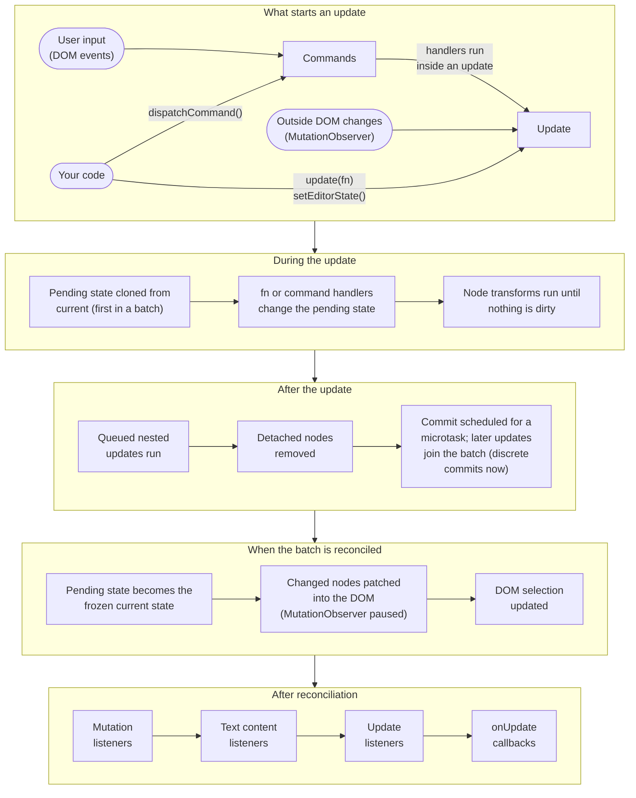

import UpdateLifecycle from '@site/src/components/UpdateLifecycle';

# Updates

Every change to the document happens in an update. Updates are synchronous:
the callback you pass to `editor.update()` runs right away and changes a
pending copy of the editor state. Committing that state and applying it to the
DOM is batched, so several updates in the same tick lead to one DOM change.
See [Editor State](./editor-state.md#updating-state) for how to read and write
the state inside an update.

## The update lifecycle {#update-lifecycle}

Lexical uses double-buffering. The current editor state is frozen; an update
works on a pending copy, and updates made in the same tick are batched into
it. When the batch commits, the pending state becomes the new, frozen current
state, and the reconciler changes only the parts of the DOM that belong to
nodes the updates changed, so it skips most of the diffing a virtual DOM would
do. Keeping every committed state frozen is also what makes features such as
undo/redo cheap to implement. This is what happens, in order:



To see how a real change moves through these phases, step through one of
these examples:

<UpdateLifecycle />

To make an update commit before `editor.update()` returns, pass
`{discrete: true}`; see
[Synchronous reconciliation with discrete updates](./editor-state.md#synchronous-reconciliation-with-discrete-updates).

## Changes from outside Lexical {#outside-changes}

The editor state, not the DOM, is the source of truth. For some plain typing,
Lexical lets the browser change the DOM itself for performance and then
updates the editor state from the `input` event. Beyond that, Lexical watches
its root element with a `MutationObserver` (paused while the reconciler makes
its own changes) and handles any other change that did not come from Lexical.
It keeps a change only if it looks like native text input, and reverts
everything else:

- **Kept: text changes inside a text node.** When the characters of a DOM
  text node that Lexical rendered change, which is what typing, spellcheck,
  autocorrect, and IME composition produce, Lexical reads the new text into
  the matching `TextNode`. Changes that arrive right after a text input event
  are left to the `input` handler instead.
- **Reverted: structural changes.** Elements or other DOM nodes added or
  removed inside the editor, for example by a browser extension, a script, or
  the browser's own editing of block structure, are undone. Added nodes are
  removed, removed nodes are put back by their parent node, stray `<br>`
  elements the browser adds are cleaned up, and the previous selection is
  restored, so the DOM matches the current editor state again.
- **Ignored: DOM that Lexical does not manage.** The contents of decorator
  nodes belong to your framework, and DOM that a node or extension adds on
  purpose can be marked with `setDOMUnmanaged()` so the observer leaves it
  alone.

## Update Tags

Update tags are string identifiers that can be attached to an update to indicate its type or purpose. They can be used to control how updates are processed, merged, or handled by listeners. Multiple tags can be used in a single update.

You can add tags in two ways:

1. Using the `tag` option in `editor.update()`:

```js
import {HISTORY_PUSH_TAG, PASTE_TAG} from 'lexical';

editor.update(
  () => {
    // Your update code
  },
  {
    tag: HISTORY_PUSH_TAG, // Single tag
  },
);

editor.update(
  () => {
    // Your update code
  },
  {
    tag: [HISTORY_PUSH_TAG, PASTE_TAG], // Multiple tags
  },
);
```

2. Using the `$addUpdateTag()` function within an update:

```js
import {HISTORY_PUSH_TAG} from 'lexical';

editor.update(() => {
  $addUpdateTag(HISTORY_PUSH_TAG);
  // Your update code
});
```

You can check if a tag is present using `$hasUpdateTag()`:

```js
import {HISTORIC_TAG} from 'lexical';

editor.update(() => {
  $addUpdateTag(HISTORIC_TAG);
  console.log($hasUpdateTag(HISTORIC_TAG)); // true
});
```

Note: While update tags can be checked within the same update using `$hasUpdateTag()`, they are typically accessed in update and mutation listeners through the `tags` and `updateTags` properties in their respective payloads. Here's the more common usage pattern:

```js
import {HISTORIC_TAG} from 'lexical';

editor.registerUpdateListener(({tags}) => {
  if (tags.has(HISTORIC_TAG)) {
    // Handle updates with historic tag
  }
});

editor.registerMutationListener(MyNode, (mutatedNodes, {updateTags}) => {
  // updateTags contains tags from the current update
  if (updateTags.has(HISTORIC_TAG)) {
    // Handle mutations with historic tag
  }
});
```

### Common Update Tags

Lexical provides several built-in update tags that are exported as constants:

- `HISTORIC_TAG`: Indicates that the update is related to history operations (undo/redo)
- `HISTORY_PUSH_TAG`: Forces a new history entry to be created
- `HISTORY_MERGE_TAG`: Merges the current update with the previous history entry
- `PASTE_TAG`: Indicates that the update is related to a paste operation. `@lexical/history` treats this as a history boundary so the paste gets its own undo entry
- `CUT_TAG`: Indicates that the update is related to a cut operation. `@lexical/history` treats this as a history boundary so the cut gets its own undo entry
- `COLLABORATION_TAG`: Indicates that the update is related to collaborative editing
- `SKIP_COLLAB_TAG`: Indicates that the update should skip collaborative sync
- `SKIP_SCROLL_INTO_VIEW_TAG`: Prevents scrolling the selection into view
- `SKIP_DOM_SELECTION_TAG`: Prevents updating the DOM selection (useful for updates that shouldn't affect focus)

### Tag Validation

To prevent typos and ensure type safety when using update tags, Lexical exports constants for all built-in tags. It's recommended to always use these constants instead of string literals:

```js
import {HISTORIC_TAG, HISTORY_PUSH_TAG, COLLABORATION_TAG} from 'lexical';

editor.update(() => {
  // Using constants ensures type safety and prevents typos
  $addUpdateTag(HISTORIC_TAG);

  // These constants can be used in update options
  editor.update(
    () => {
      // Your update code
    },
    {
      tag: HISTORY_PUSH_TAG,
    },
  );

  // And in listener checks
  editor.registerUpdateListener(({tags}) => {
    if (tags.has(COLLABORATION_TAG)) {
      // Handle collaborative updates
    }
  });
});
```

### Custom Tags

While Lexical provides common tags as constants, you can also define your own constants for custom tags to maintain consistency and type safety:

```js
// Define your custom tags as constants
const MY_FEATURE_TAG = 'my-custom-feature';
const MY_UPDATE_TAG = 'my-custom-update';

editor.update(
  () => {
    $addUpdateTag(MY_FEATURE_TAG);
  },
  {
    tag: MY_UPDATE_TAG,
  },
);

// Listen for updates with specific tags
editor.registerUpdateListener(({tags}) => {
  if (tags.has(MY_FEATURE_TAG)) {
    // Handle updates from your custom feature
  }
});
```
