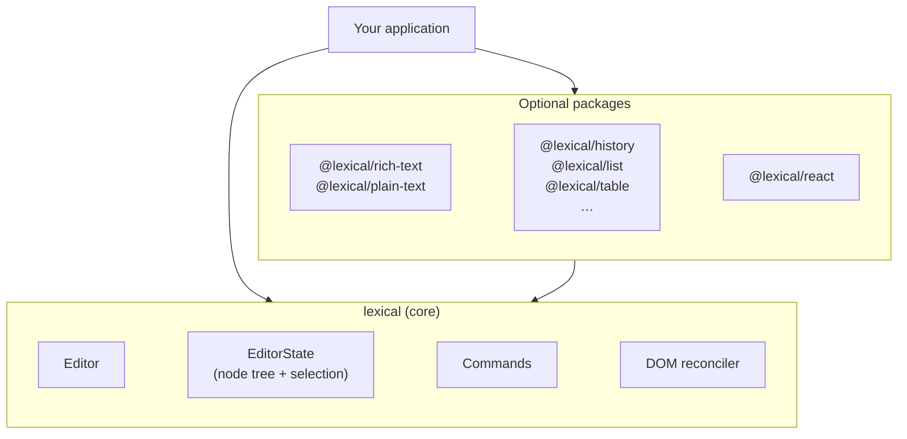

# Introduction

Lexical is an extensible text editor framework for the web, built for
reliability, accessibility, and performance. It gives you a small,
dependency-free core and a set of optional packages that you compose into the
editor you need, from a plain-text input with mentions to a collaborative
rich-text document editor.

Lexical attaches to a `contenteditable` element and keeps its own model of the
document. You read and change that model with Lexical's APIs, and Lexical
takes care of keeping the DOM, the selection, and the browser's many
`contenteditable` quirks in sync. Most code never touches the DOM directly;
the main exception is custom nodes, which define how they render.

## What can you build? {#what-can-be-built-with-lexical}

- Plain-text inputs that need more than a `<textarea>`: mentions, hashtags,
  links, custom emoji.
- Rich-text editors for comments, posts, and messages.
- Full document editors with tables, lists, code blocks, and images, for a CMS
  or a notes app.
- Real-time collaborative editing with shared content and remote cursors,
  using the [Yjs integration](./collaboration/react.md).

Lexical supplies the editing infrastructure. Your application supplies the
layout, toolbars, menus, styling, and storage.

Lexical is an open-source community project. It began at Meta, and its
contributors today include Meta engineers alongside many volunteers and
developers from other companies. It powers text editing in Meta's web products
and is also the editor behind
[Ghost](https://ghost.org), [Payload CMS](https://payloadcms.com),
[Supabase](https://supabase.com),
[Proton Docs](https://proton.me/drive/document-editor),
[MDXEditor](https://mdxeditor.dev), [Sveltia CMS](https://sveltiacms.app),
[Dify](https://dify.ai), [RAGFlow](https://ragflow.io),
[DeepSeek Harness](https://deepseek.com/harness/), and
[Paperclip](https://paperclip.ing). To see
what it can do, try the [playground](https://playground.lexical.dev).

## How it fits together

The `lexical` package is the core: the editor, the editor state, the base
node types, selection, commands, and the DOM reconciler. Everything else is an
optional package built on top of it, so an application only includes the
features it uses. The core is framework-agnostic, and `@lexical/react`
provides React bindings.



Features are added to an editor as [extensions](./extensions/intro.md). An
extension bundles everything a feature needs (its nodes, configuration,
commands, and listeners, plus any extensions it depends on) so it can be
added in one place:

```ts
import {buildEditorFromExtensions} from '@lexical/extension';
import {HistoryExtension} from '@lexical/history';
import {RichTextExtension} from '@lexical/rich-text';
import {defineExtension} from 'lexical';

const editor = buildEditorFromExtensions(
  defineExtension({
    dependencies: [RichTextExtension, HistoryExtension],
    name: '@my-app/editor',
    namespace: 'my-app',
  }),
);
editor.setRootElement(document.getElementById('editor'));
```

In React, [`LexicalExtensionComposer`](./extensions/react.md) does the same
job. The [Quick Start](./getting-started/quick-start.md) and
[React guide](./getting-started/react.md) walk through a complete setup.

## Core concepts {#lexicals-design}

These are the ideas the rest of the documentation builds on. Each one links to
a page with the details.

### Editor {#editor-instances}

The editor wires everything together. It owns the current editor state,
attaches to a root DOM element, and is where you register nodes, listeners,
transforms, and commands. You usually create it with
`buildEditorFromExtensions` or through the React bindings rather than calling
`createEditor()` yourself.

### Editor state {#editor-states}

An [editor state](./concepts/editor-state.md) is an immutable snapshot of the
document: a tree of [nodes](./concepts/nodes.mdx) under a single `RootNode`,
plus a [selection](./concepts/selection.md). The editor state, not the DOM, is
the source of truth. Its `toJSON()` output is how you save and restore content.

### A DOM-like document tree {#document-model}

Lexical's node tree is shaped like the HTML it renders. A paragraph contains
its text, and a link is an element that contains the text it wraps, where
editors such as ProseMirror keep a textblock's content flat and use marks for
links. [Document Model](./concepts/document-model.md) compares the two in
detail.

### Reading and updating editor state {#reading-and-updating-editor-state}

All reads and writes happen inside a synchronous callback, such as
`editor.update(fn)` or `editor.read('force-commit', fn)`. Functions whose
names start with `$`, such as `$getRoot()`, only work inside those callbacks,
in the same way React Hooks only work while a component renders. See
[Editor State](./concepts/editor-state.md#updating-state).

### Updates and the DOM reconciler {#dom-reconciler}

Updates change a pending copy of the editor state. Updates in the same tick
are batched, and when the batch commits, the reconciler patches only the DOM
that belongs to changed nodes. Lexical also watches for DOM changes made
outside it and keeps or reverts them. [Updates](./concepts/updates.mdx) walks
through each phase, with an interactive example.

### Commands, transforms, and listeners {#listeners-node-transforms-and-commands}

Most editor behavior is built from three kinds of hooks.
[Commands](./concepts/commands.md) carry user input and your own actions to
handlers in priority order. [Node transforms](./concepts/transforms.md) run
during an update to keep the document in shape.
[Listeners](./concepts/listeners.md) react after an update is committed.

### Serialization and running on a server

Content converts to and from JSON, HTML, and Markdown; see
[Serialization](./serialization/serialization.md). An editor with no root
element does no DOM work at all, so the same code can run on a server or in
tests; see [Running Without a Browser](./concepts/headless.md).

## Get started

- [Quick Start](./getting-started/quick-start.md) builds an editor without a
  framework, and [Getting Started with React](./getting-started/react.md) does
  the same in React.
- [Lexical Extensions](./extensions/intro.md) and
  [Included Extensions](./extensions/included-extensions.md) cover how to add
  features.
- The [playground](https://playground.lexical.dev) shows many features working
  together.
