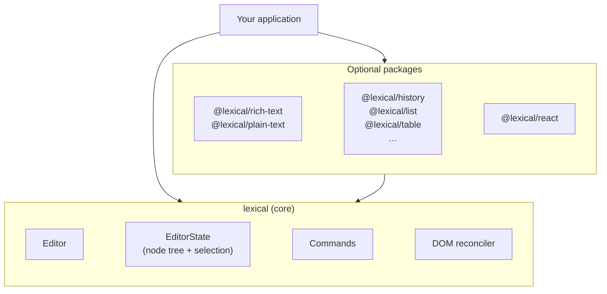
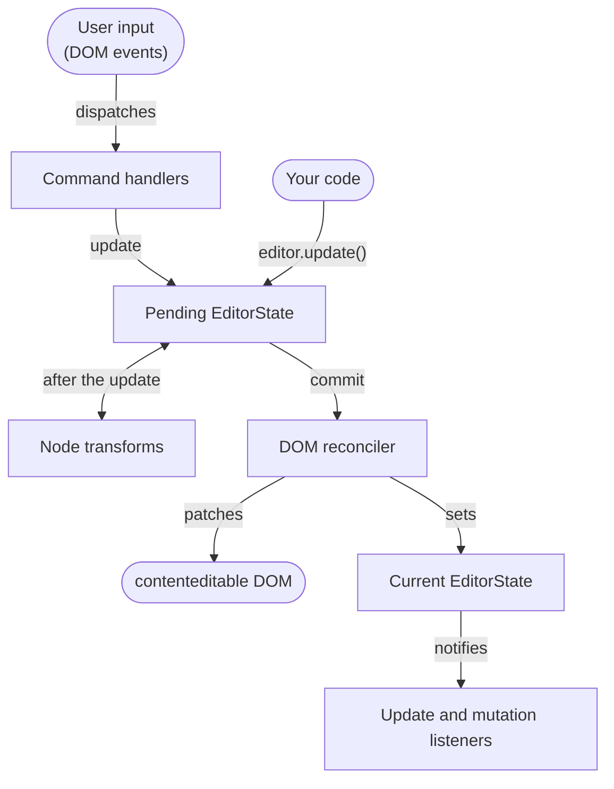

# Introduction

Lexical is an extensible text editor framework for the web, built for
reliability, accessibility, and performance. It gives you a small,
dependency-free core and a set of optional packages that you compose into the
editor you need, from a plain-text input with mentions to a collaborative
rich-text document editor.

Lexical attaches to a `contenteditable` element and keeps its own model of the
document. You read and change that model with Lexical's APIs, and Lexical
takes care of keeping the DOM, the selection, and the browser's many
`contenteditable` quirks in sync. Most code never touches the DOM directly;
the main exception is custom nodes, which define how they render.

## What can you build?

- Plain-text inputs that need more than a `<textarea>`: mentions, hashtags,
  links, custom emoji.
- Rich-text editors for comments, posts, and messages.
- Full document editors with tables, lists, code blocks, and images, for a CMS
  or a notes app.
- Real-time collaborative editing, using the [Yjs](https://yjs.dev)
  integration in `@lexical/yjs`.

Lexical is developed at Meta, where it powers text editing across its web
products. To see what it can do, try the
[playground](https://playground.lexical.dev).

## How it fits together

The `lexical` package is the core: the editor, the editor state, the base
node types, selection, commands, and the DOM reconciler. Everything else is an
optional package built on top of it, so an application only includes the
features it uses. The core is framework-agnostic, and `@lexical/react`
provides React bindings.



Features are added to an editor as [extensions](./extensions/intro.md). An
extension bundles everything a feature needs (its nodes, configuration,
commands, and listeners, plus any extensions it depends on) so it can be
added in one place:

```ts
import {buildEditorFromExtensions} from '@lexical/extension';
import {HistoryExtension} from '@lexical/history';
import {RichTextExtension} from '@lexical/rich-text';
import {defineExtension} from 'lexical';

const editor = buildEditorFromExtensions(
  defineExtension({
    dependencies: [RichTextExtension, HistoryExtension],
    name: '@my-app/editor',
    namespace: 'my-app',
  }),
);
editor.setRootElement(document.getElementById('editor'));
```

In React, [`LexicalExtensionComposer`](./extensions/react.md) does the same
job. The [Quick Start](./getting-started/quick-start.md) and
[React guide](./getting-started/react.md) walk through a complete setup.

## Core concepts

### Editor

The editor wires everything together. It owns the current editor state,
attaches to a root DOM element, and is where you register nodes, listeners,
transforms, and commands. You usually create it with
`buildEditorFromExtensions` or through the React bindings rather than calling
`createEditor()` yourself.

### Editor state

An [`EditorState`](./concepts/editor-state.md) is an immutable snapshot of the
document. It holds two things:

- a tree of [nodes](./concepts/nodes.mdx), starting from a single `RootNode`
- a [selection](./concepts/selection.md), or `null`

`editor.getEditorState()` returns the current state. Editor states serialize
to JSON with `editorState.toJSON()`, and `editor.parseEditorState()` turns
that JSON back into a state you can pass to `editor.setEditorState()`. See
[Serialization](./serialization/serialization.md) for JSON, HTML, and
Markdown.

### Reading and Updating Editor State

All reads and writes of the document happen inside a synchronous callback:

```js
import {$createParagraphNode, $createTextNode, $getRoot} from 'lexical';

editor.update(() => {
  const paragraph = $createParagraphNode();
  paragraph.append($createTextNode('Hello world'));
  $getRoot().append(paragraph);
});

const text = editor.read(() => $getRoot().getTextContent());
```

Functions whose names start with `$`, such as `$getRoot()` and
`$getSelection()`, only work inside one of these callbacks, because they act
on the active editor state. Calling them anywhere else throws an error. The
convention is similar to React Hooks:

| | React Hooks | Lexical `$` functions |
| -- | -- | -- |
| Naming | `useFunction` | `$function` |
| Can only be called | while rendering a component | inside an update or read |
| Can call others of the same kind | ✅ | ✅ |
| Must be synchronous | ✅ | ✅ |
| Must be called unconditionally, in the same order | ✅ | ❌ No such rule |

Command handlers and node transforms already run inside an update, so they
can call `$` functions directly.

The same rule applies to node objects. Call node methods only inside a read or
update. Every node has a key that identifies it across versions of the editor
state, and node methods use that key to find the latest version of the node.
This is why a node reference taken earlier in an update stays usable after the
node changes. Keys exist only at runtime: they are not serialized, and you
should treat them as opaque.

Which state you see depends on how you read it:

- Inside `editor.update()` you see the **pending** state, where your changes
  are visible but transforms and reconciliation may not have run yet.
  `editor.read('pending', fn)` gives you the same view without allowing
  changes.
- `editor.read(fn)` first commits any pending updates, so it always sees a
  consistent, reconciled state. Do not call it inside an update.
- `editor.read('latest', fn)` reads the most recently reconciled state without
  committing anything, so pending changes are not visible.

Avoid nesting one `editor.update()` inside another: the inner update does not
run immediately but is queued to run after the outer one. Never start an
update inside a read.

### Updates and the DOM reconciler

Lexical uses double-buffering. The current editor state is frozen; an update
works on a pending copy. Several updates made in the same tick are batched,
and then the reconciler compares the pending state with the current one and
changes only the parts of the DOM that differ. Because Lexical tracks which
nodes each update changed, it skips most of the diffing a virtual DOM would
do. The pending state then becomes the new, frozen current state, which makes
features such as undo/redo cheap to implement.



For some simple text input, Lexical lets the browser change the DOM itself for
performance and then updates the editor state to match. Lexical can also run
without a DOM at all with [`@lexical/headless`](/docs/packages/lexical-headless),
for example on a server.

### Commands, transforms, and listeners

Most editor behavior is built from three kinds of hooks. Each `register*`
method returns a function that removes what it registered.

- **[Commands](./concepts/commands.md)** are how everything communicates.
  Lexical turns keyboard, clipboard, and other DOM events into commands, and
  you can create your own with `createCommand()`. Send one with
  `editor.dispatchCommand(command, payload)`. Handlers registered with
  `editor.registerCommand(command, handler, priority)` run in priority order
  until one returns `true` to stop propagation.
- **[Node transforms](./concepts/transforms.md)**, registered with
  `editor.registerNodeTransform(NodeClass, fn)`, run during an update whenever
  a node of that class has changed. They are the efficient way to keep the
  document in a normalized shape, such as turning `#hashtag` text into a
  hashtag node.
- **[Listeners](./concepts/listeners.md)** are notified after an update has
  been committed. For example:

```js
const unregister = editor.registerUpdateListener(({editorState}) => {
  editorState.read(() => {
    console.log($getRoot().getTextContent());
  });
});

// Later, when you no longer need it:
unregister();
```

When you package these into an [extension](./extensions/defining-extensions.md),
the editor calls the cleanup for you when it is disposed.
