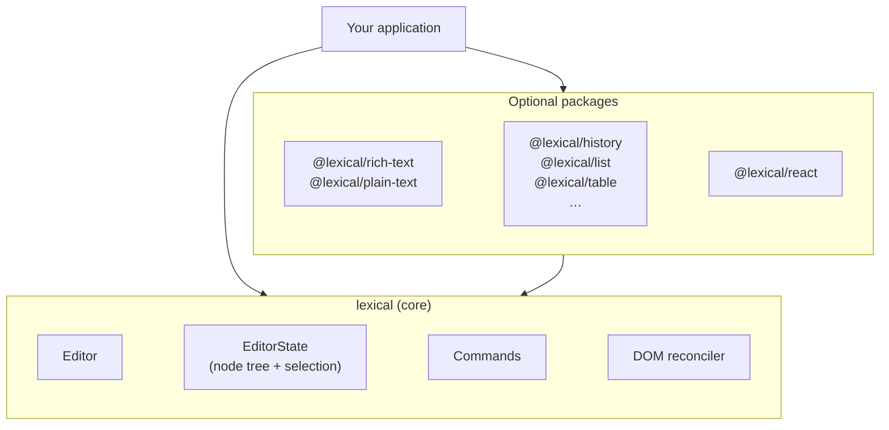
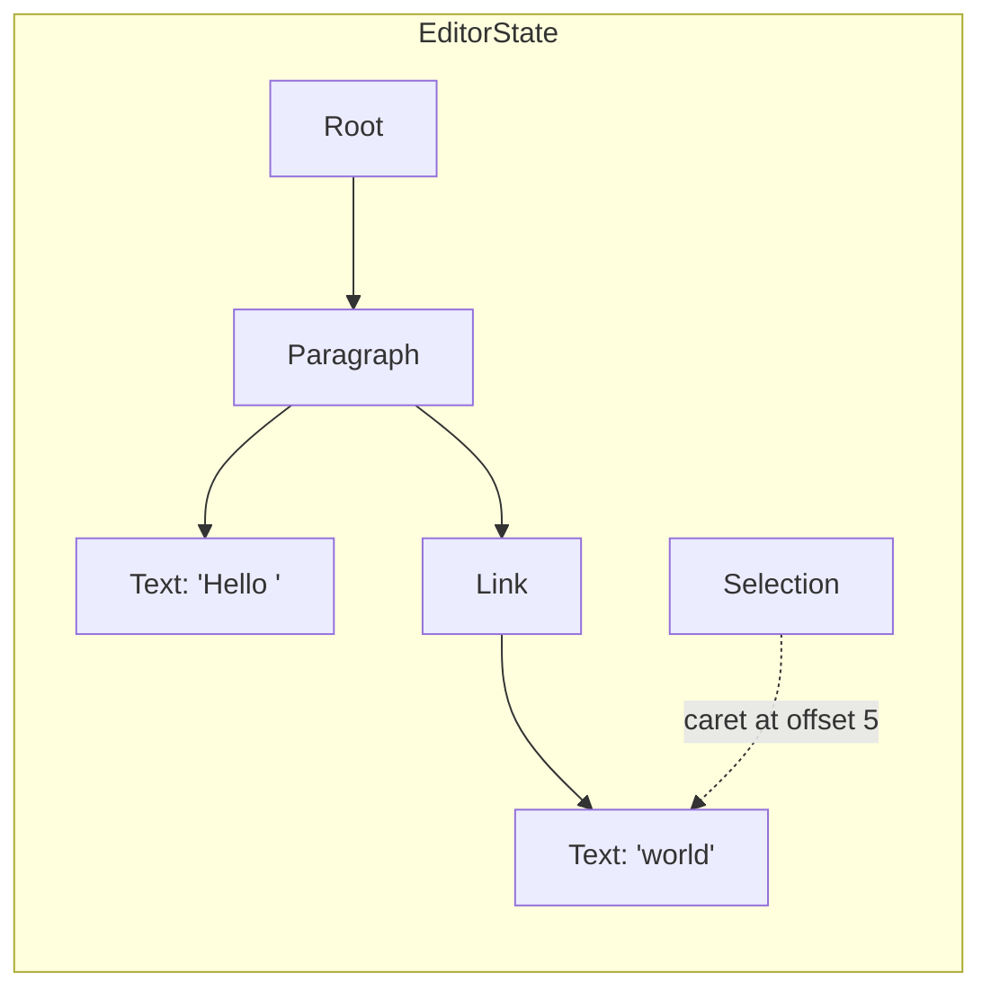
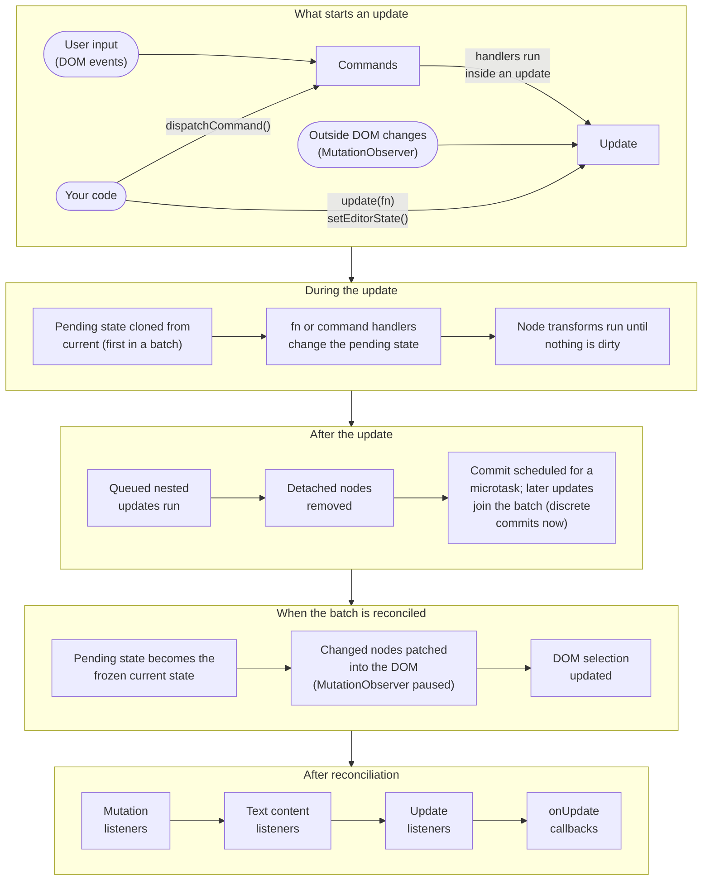

# Introduction

Lexical is an extensible text editor framework for the web, built for
reliability, accessibility, and performance. It gives you a small,
dependency-free core and a set of optional packages that you compose into the
editor you need, from a plain-text input with mentions to a collaborative
rich-text document editor.

Lexical attaches to a `contenteditable` element and keeps its own model of the
document. You read and change that model with Lexical's APIs, and Lexical
takes care of keeping the DOM, the selection, and the browser's many
`contenteditable` quirks in sync. Most code never touches the DOM directly;
the main exception is custom nodes, which define how they render.

## What can you build? {#what-can-be-built-with-lexical}

- Plain-text inputs that need more than a `<textarea>`: mentions, hashtags,
  links, custom emoji.
- Rich-text editors for comments, posts, and messages.
- Full document editors with tables, lists, code blocks, and images, for a CMS
  or a notes app.
- Real-time collaborative editing with shared content and remote cursors,
  using the [Yjs integration](./collaboration/react.md).

Lexical supplies the editing infrastructure. Your application supplies the
layout, toolbars, menus, styling, and storage.

Lexical is developed at Meta, where it powers text editing across its web
products. It is also the editor behind
[Ghost's Koenig editor](https://ghost.org/changelog/new-editor/),
[Payload CMS](https://payloadcms.com/docs/rich-text/overview),
[Proton Docs](https://github.com/ProtonMail/WebClients/tree/main/applications/docs-editor),
[Sveltia CMS](https://sveltiacms.app/en/docs/fields/richtext), and
[Dify](https://github.com/langgenius/dify). To see what it can do, try the
[playground](https://playground.lexical.dev).

## How it fits together

The `lexical` package is the core: the editor, the editor state, the base
node types, selection, commands, and the DOM reconciler. Everything else is an
optional package built on top of it, so an application only includes the
features it uses. The core is framework-agnostic, and `@lexical/react`
provides React bindings.



Features are added to an editor as [extensions](./extensions/intro.md). An
extension bundles everything a feature needs (its nodes, configuration,
commands, and listeners, plus any extensions it depends on) so it can be
added in one place:

```ts
import {buildEditorFromExtensions} from '@lexical/extension';
import {HistoryExtension} from '@lexical/history';
import {RichTextExtension} from '@lexical/rich-text';
import {defineExtension} from 'lexical';

const editor = buildEditorFromExtensions(
  defineExtension({
    dependencies: [RichTextExtension, HistoryExtension],
    name: '@my-app/editor',
    namespace: 'my-app',
  }),
);
editor.setRootElement(document.getElementById('editor'));
```

In React, [`LexicalExtensionComposer`](./extensions/react.md) does the same
job. The [Quick Start](./getting-started/quick-start.md) and
[React guide](./getting-started/react.md) walk through a complete setup.

## Core concepts {#lexicals-design}

### Editor {#editor-instances}

The editor wires everything together. It owns the current editor state,
attaches to a root DOM element, and is where you register nodes, listeners,
transforms, and commands. You usually create it with
`buildEditorFromExtensions` or through the React bindings rather than calling
`createEditor()` yourself.

### Editor state {#editor-states}

An [`EditorState`](./concepts/editor-state.md) is a snapshot of the document.
Once committed it is immutable, so later edits never change an earlier state.
It holds two things:

- a tree of [nodes](./concepts/nodes.mdx), starting from a single `RootNode`
- a [selection](./concepts/selection.md), or `null`

For example, "Hello world" with a link around "world" and the caret at the
end looks like this:



`editor.getEditorState()` returns the latest committed state. Its `toJSON()`
method serializes the document tree only; the selection and the runtime node
keys are not included. To restore saved content, pass the JSON to
`editor.parseEditorState()` and the result to `editor.setEditorState()`. The
editor must have the same node types registered. See
[Serialization](./serialization/serialization.md) for JSON, HTML, and
Markdown.

### A DOM-like document tree

Lexical's node tree is shaped like the HTML it renders. A paragraph is an
`ElementNode` whose children are the nodes inside it, and inline structure
nests the same way: a link is a `LinkNode` element that contains the text
nodes it wraps, just as an `<a>` contains its text. Each node type decides how
it renders with `createDOM()` and `updateDOM()`, so the model maps closely to
the DOM, and a position in the document is a node plus an offset within it.

This is a deliberate difference from editors such as
[ProseMirror](https://prosemirror.net). ProseMirror's document is also a tree,
and blocks can contain other blocks, but the inline content of a textblock is
a flat sequence of nodes (text and inline nodes) with marks for formatting and
links, and every position in the document is a single integer.

| | Lexical | ProseMirror |
| -- | -- | -- |
| Document | Immutable tree of nodes, one `RootNode` | Immutable tree of nodes, one `doc` node |
| Node identity and navigation | Each node has a runtime key and knows its parent and siblings | Nodes are plain values with no parent links; a resolved position supplies ancestor context |
| Blocks | `ElementNode` subclasses (paragraph, heading, list, table, …), or a block `DecoratorNode` (image, embed, …) | Block nodes defined in the schema |
| Inline formatting | Format flags on each `TextNode` (bold, italic, code, …) | Marks on text |
| Links and other inline wrappers | Inline `ElementNode`s (`LinkNode`, `MarkNode`) that contain text nodes | Marks on text, like formatting |
| Embedded content | `DecoratorNode`, inline or block, rendered by your framework (for example React) | Leaf or atom nodes, often with a custom `NodeView` |
| Several editable regions in one node | [Named slots](./concepts/named-slots.md): regions addressed by name, like a card's `title`, each isolated so editing and selection never cross the boundary | Child nodes in the order the schema's content expression allows, optionally marked `isolating`, or a separate editor inside a `NodeView` |
| Addressing a position | Node key plus offset (`{key, offset, type}`) | One integer counted across the whole document |
| Allowed structure | Declared by node classes, enforced with node transforms and normalization | Declared by a schema of content expressions |
| Applying edits | Call node and selection methods inside `editor.update()` | Build a transaction from steps that address positions or ranges |
| Rendering | Each node's `createDOM()`/`updateDOM()`, applied by the reconciler | `toDOM` in the schema, or a `NodeView` |

In practice, this means Lexical code navigates the document the way DOM code
does, with methods like `getParent()`, `getChildren()`, and `getNextSibling()`,
and each node owns the DOM it renders. The resemblance is structural, not one
node per HTML element: bold or italic text, for example, is a format on a
`TextNode`, not a separate `<strong>` or `<em>` node. See
[Nodes](./concepts/nodes.mdx) for the built-in node types.

### Reading and updating editor state {#reading-and-updating-editor-state}

All reads and writes of the document happen inside a synchronous callback:

```js
import {$createParagraphNode, $createTextNode, $getRoot} from 'lexical';

editor.update(() => {
  const paragraph = $createParagraphNode();
  paragraph.append($createTextNode('Hello world'));
  $getRoot().append(paragraph);
});

const text = editor.read('force-commit', () => $getRoot().getTextContent());
```

Functions whose names start with `$`, such as `$getRoot()` and
`$getSelection()`, only work inside one of these callbacks, because they act
on the active editor state. Calling them anywhere else throws an error. The
convention is similar to React Hooks:

| | React Hooks | Lexical `$` functions |
| -- | -- | -- |
| Naming | `useFunction` | `$function` |
| Can only be called | while rendering a component | inside an update or read |
| Can call others of the same kind | ✅ | ✅ |
| Must be synchronous | ✅ | ✅ |
| Must be called unconditionally, in the same order | ✅ | ❌ No such rule |

Command handlers and node transforms already run inside an update, so they
can call `$` functions directly.

The same rule applies to node objects. Call node methods only inside a read or
update. Every node has a key that identifies it across versions of the editor
state, and node methods use that key to find the latest version of the node.
This is why a node reference taken earlier in an update stays usable after the
node changes. Keys exist only at runtime: they are not serialized, and you
should treat them as opaque.

Which state you see depends on how you read it:

- Inside `editor.update()` you see the **pending** state, where your changes
  are visible but transforms and reconciliation may not have run yet.
  `editor.read('pending', fn)` gives you the same view without allowing
  changes.
- `editor.read('force-commit', fn)` first commits any pending updates, so it
  always sees a consistent, reconciled state. Do not call it inside an update.
  `editor.read(fn)` with no mode does the same thing, and is kept for
  convenience and backwards compatibility.
- `editor.read('latest', fn)` reads the most recently reconciled state without
  committing anything, so pending changes are not visible.
- `editorState.read(fn)` reads one particular snapshot, such as the
  `editorState` an update listener receives.

Because the callbacks are synchronous, do any asynchronous work (fetching
data, awaiting a promise) first, and then enter an update with the result.

Avoid nesting one `editor.update()` inside another: the inner update does not
run immediately but is queued to run after the outer one. Never start an
update inside a read.

### Updates and the DOM reconciler {#dom-reconciler}

Lexical uses double-buffering. The current editor state is frozen; an update
works on a pending copy, and updates made in the same tick are batched into
it. When the batch commits, the pending state becomes the new, frozen current
state, and the reconciler changes only the parts of the DOM that belong to
nodes the updates changed, so it skips most of the diffing a virtual DOM would
do. Keeping every committed state frozen is also what makes features such as
undo/redo cheap to implement. This is what happens, in order:



The editor state, not the DOM, is the source of truth. For some plain typing,
Lexical lets the browser change the DOM itself for performance and then
updates the editor state from the `input` event. Beyond that, Lexical watches
its root element with a `MutationObserver` (paused while the reconciler makes
its own changes) and handles any other change that did not come from Lexical:

- **Text edits** inside a text node that arrive without an input event Lexical
  handled (for example from autocorrect or a browser extension) are read back
  into the editor state.
- **Other changes**, such as elements added or removed by a browser extension
  or other script, are reverted so the DOM matches the current editor state
  again. DOM that a node or extension adds on purpose can opt out with
  `setDOMUnmanaged()`.

### Running without a browser

The DOM is only needed to show an editor on screen. Because every read and
update goes through the editor state, Lexical also works where there is no
browser DOM:

- **With no DOM at all**, using
  [`@lexical/headless`](/docs/packages/lexical-headless). A headless editor
  supports updates, transforms, listeners, commands, and JSON serialization,
  which is enough to process documents on a server, apply changes from a
  collaboration backend, or write tests.
- **With a virtual DOM** such as happy-dom or jsdom, for the features that
  create DOM nodes, like HTML import and export. `withDOM()` from
  `@lexical/headless/dom` runs a callback with a temporary happy-dom window,
  for example to convert HTML on a server. See
  [Serialization](./serialization/serialization.md) for an example.

### Commands, transforms, and listeners {#listeners-node-transforms-and-commands}

Most editor behavior is built from three kinds of hooks. Each `register*`
method returns a function that removes what it registered.

- **[Commands](./concepts/commands.md)** are how everything communicates.
  Lexical turns keyboard, clipboard, and other DOM events into commands, and
  you can create your own with `createCommand()`. Send one with
  `editor.dispatchCommand(command, payload)`. Handlers registered with
  `editor.registerCommand(command, handler, priority)` run in priority order
  until one returns `true` to stop propagation.
- **[Node transforms](./concepts/transforms.md)**, registered with
  `editor.registerNodeTransform(NodeClass, fn)`, run during an update whenever
  a node of that class has changed. They are the efficient way to keep the
  document in a normalized shape, such as turning `#hashtag` text into a
  hashtag node, because they run inside the same update rather than
  scheduling another one from a listener.
- **[Listeners](./concepts/listeners.md)** react to changes in the editor.
  Update listeners, the most common kind, are called after each update has
  been committed; others, such as root and editable listeners, fire when the
  root element or the editable state changes. For example:

```js
const unregister = editor.registerUpdateListener(({editorState}) => {
  editorState.read(() => {
    console.log($getRoot().getTextContent());
  });
});

// Later, when you no longer need it:
unregister();
```

When you package these into an [extension](./extensions/defining-extensions.md),
the editor calls the cleanup for you when it is disposed.

## Get started

- [Quick Start](./getting-started/quick-start.md) builds an editor without a
  framework, and [Getting Started with React](./getting-started/react.md) does
  the same in React.
- [Lexical Extensions](./extensions/intro.md) and
  [Included Extensions](./extensions/included-extensions.md) cover how to add
  features.
- The [playground](https://playground.lexical.dev) shows many features working
  together.
